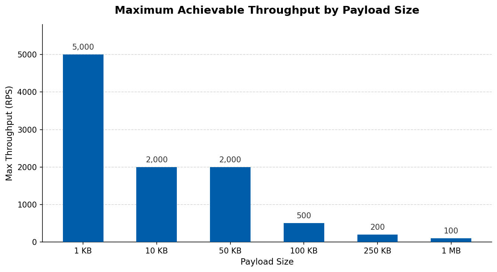
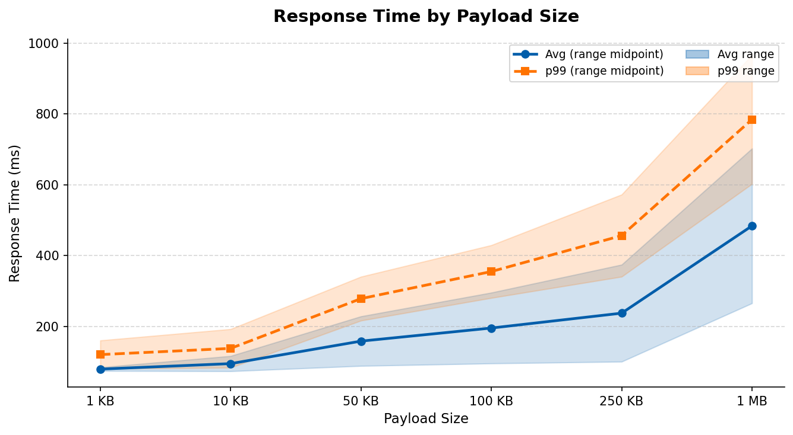
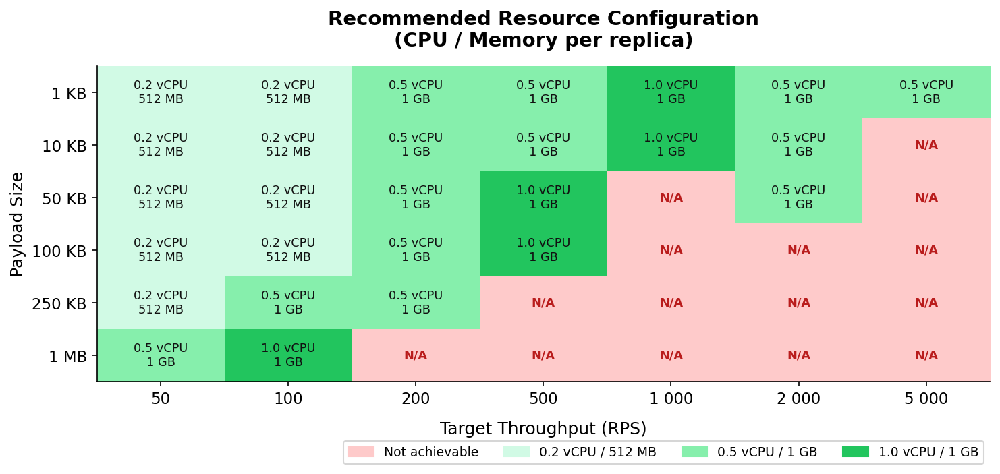

# WSO2 Cloud PDP — Capacity Planning Guide

**Scenario:** HTTP Passthrough \
**Product:** WSO2 Integrator: BI \
**Product Version:** Ballerina 2202.13.1 (Swan Lake Update 13) \
**Date:** 2026-03-03

---

## Table of Contents

- [Overview](#overview)
- [How to Use This Guide](#how-to-use-this-guide)
- [Quick Reference: Maximum Supported Throughput](#quick-reference-maximum-supported-throughput)
- [Expected Response Times](#expected-response-times)
- [Resource Configuration Reference](#resource-configuration-reference)
- [Concurrent Connections Guide](#concurrent-connections-guide)
- [Known Limitations](#known-limitations)
- [Deployment Recommendations](#deployment-recommendations)
- [Need Help?](#need-help)

## Overview

This guide helps you select the right resource configuration for your WSO2 Cloud Private Data Plane (PDP) deployment. Based on your expected traffic profile — throughput, payload size, and concurrent connections — you can use the tables below to determine the minimum CPU/memory allocation and replica count needed.

> **Note:** Results are based on HTTP passthrough testing with scale-to-zero disabled and endpoint authentication enabled. Response times reflect unsaturated service conditions (best-case latency).

---

## How to Use This Guide

1. **Identify your traffic profile**: Estimate your target throughput (requests per second), typical payload size, and number of concurrent connections from your clients.
2. **Find your configuration**: Look up the matching row in the [Resource Configuration Reference](#resource-configuration-reference) table.
3. **Apply the recommendation**: Use the suggested CPU, memory, and minimum replica count when deploying your component on WSO2 Cloud PDP.

---

## Quick Reference: Maximum Supported Throughput

Use this table to understand the upper throughput limit for each payload size, assuming adequate concurrent connections.

| Payload Size | Max Supported Throughput | Minimum Concurrent Connections Required |
| :----------- | :----------------------- | :-------------------------------------- |
| 1 KB         | 5000 RPS                 | 500                                     |
| 10 KB        | 2000 RPS                 | 500                                     |
| 50 KB        | 2000 RPS                 | 500                                     |
| 100 KB       | 500 RPS                  | 100                                     |
| 250 KB       | 200 RPS                  | 50                                      |
| 1 MB         | 100 RPS                  | 50                                      |

> **Why do concurrent connections matter?** The achievable throughput depends on the number of concurrent connections your clients maintain. Too few connections create a bottleneck regardless of how many replicas are running since each request must wait for the previous one to complete.

---

## Expected Response Times

The following table shows typical response times under normal operating conditions (no CPU/memory saturation). Use these to set latency expectations and configure client timeouts appropriately.

| Payload Size | Avg Response Time | 99th Percentile |
| :----------- | :---------------- | :-------------- |
| 1 KB         | 74–84 ms          | 80–160 ms       |
| 10 KB        | 73–116 ms         | 83–192 ms       |
| 50 KB        | 88–228 ms         | 216–340 ms      |
| 100 KB       | 95–295 ms         | 280–429 ms      |
| 250 KB       | 100–374 ms        | 340–572 ms      |
| 1 MB         | 265–702 ms        | 602–966 ms      |

> Ranges reflect measurements across 10 to 500 concurrent connections. Higher concurrency slightly increases response time. All measurements are best-case (unsaturated service).

---

## Resource Configuration Reference

Use the heatmap below to quickly identify the required resource configuration, then consult the table for exact values. Darker green = more resources required; red = not achievable.

Select the row that best matches your target throughput and payload size. All configurations assume adequate concurrent connections (see the [Concurrent Connections Guide](#concurrent-connections-guide) below).

| Target Throughput | Payload Size | Recommended CPU | Recommended Memory | Expected Replicas |
| :---------------- | :----------- | :-------------- | :----------------- | :---------------- |
| Up to 50 RPS      | Up to 250 KB | 0.2 vCPU        | 512 MB             | 1                 |
| Up to 50 RPS      | 1 MB         | 0.5 vCPU        | 1 GB               | 1                 |
| Up to 100 RPS     | Up to 100 KB | 0.2 vCPU        | 512 MB             | 1                 |
| Up to 100 RPS     | 250 KB       | 0.5 vCPU        | 1 GB               | 1                 |
| Up to 100 RPS     | 1 MB         | 1.0 vCPU        | 1 GB               | 1                 |
| 101–200 RPS       | Up to 250 KB | 0.5 vCPU        | 1 GB               | 1                 |
| 101–200 RPS       | 1 MB         | Not achievable  | —                  | —                 |
| 201–500 RPS       | Up to 10 KB  | 0.5 vCPU        | 1 GB               | 1                 |
| 201–500 RPS       | 50 KB        | 1.0 vCPU        | 1 GB               | 1                 |
| 201–500 RPS       | 100 KB       | 1.0 vCPU        | 1 GB               | 1                 |
| 201–500 RPS       | 250 KB+      | Not achievable  | —                  | —                 |
| 501–1000 RPS      | Up to 10 KB  | 1.0 vCPU        | 1 GB               | 1                 |
| 501–1000 RPS      | 50 KB+       | Not achievable  | —                  | —                 |
| 1001–2000 RPS     | 1 KB         | 0.5 vCPU        | 1 GB               | 1                 |
| 1001–2000 RPS     | 10–50 KB     | 0.5 vCPU        | 1 GB               | 1                 |
| 1001–2000 RPS     | 100 KB+      | Not achievable  | —                  | —                 |
| 2001–5000 RPS     | 1 KB         | 0.5 vCPU        | 1 GB               | 1                 |
| 2001–5000 RPS     | 10 KB+       | Not achievable  | —                  | —                 |

> **"Not achievable"** means this throughput cannot be reached for the given payload size regardless of resource allocation, due to network latency constraints.

---

## Concurrent Connections Guide

The number of concurrent connections from your clients directly affects the throughput you can achieve. Use this table as a reference when sizing your client connection pools.

| Target Throughput | Minimum Concurrent Connections             |
| :---------------- | :----------------------------------------- |
| Up to 100 RPS     | 10 (small payloads ≤ 100 KB)               |
| 200 RPS           | 50                                         |
| 500 RPS           | 50 (small payloads); 100 (medium payloads) |
| 1000 RPS          | 100 (1 KB); 200 (10 KB)                    |
| 2000 RPS          | 200 (1 KB); 500 (10–50 KB)                 |
| 5000 RPS          | 500 (1 KB only)                            |

---

## Known Limitations

| Scenario                     | Details                                                                 |
| :--------------------------- | :---------------------------------------------------------------------- |
| 1 MB payloads                | Maximum achievable throughput is 100 RPS; not achievable at 200 RPS+    |
| 250 KB payloads              | Maximum achievable throughput is 200 RPS                                |
| High throughput (≥ 1000 RPS) | Only small payloads (≤ 50 KB) with high concurrency (≥ 100–500 users)   |
| Low concurrency (< 50 users) | Cannot achieve throughput above 100–200 RPS regardless of resources     |

---

## Deployment Recommendations

- **Start conservative**: Begin with **0.5 vCPU / 1 GB** as your baseline — it provides the best cost-performance trade-off for most workloads.
- **Scale up for large payloads**: Use **1.0 vCPU / 1 GB** for payloads of 50 KB–100 KB at moderate-to-high throughput.
- **Connection pooling**: Ensure your client applications maintain enough concurrent connections for your target throughput (see table above).
- **Payload compression**: For payloads larger than 100 KB, consider compressing data before transmission to stay within achievable throughput limits.

---

## Need Help?

If your requirements fall outside the supported ranges in this guide, or if you need help planning for a specific workload, contact WSO2 support with your expected throughput, payload size, and concurrency profile.

---

*This guide is based on internal performance testing of WSO2 Integrator: BI (Ballerina 2202.13.1) on WSO2 Cloud PDP. Results reflect an HTTP passthrough scenario with a single-region deployment.*
