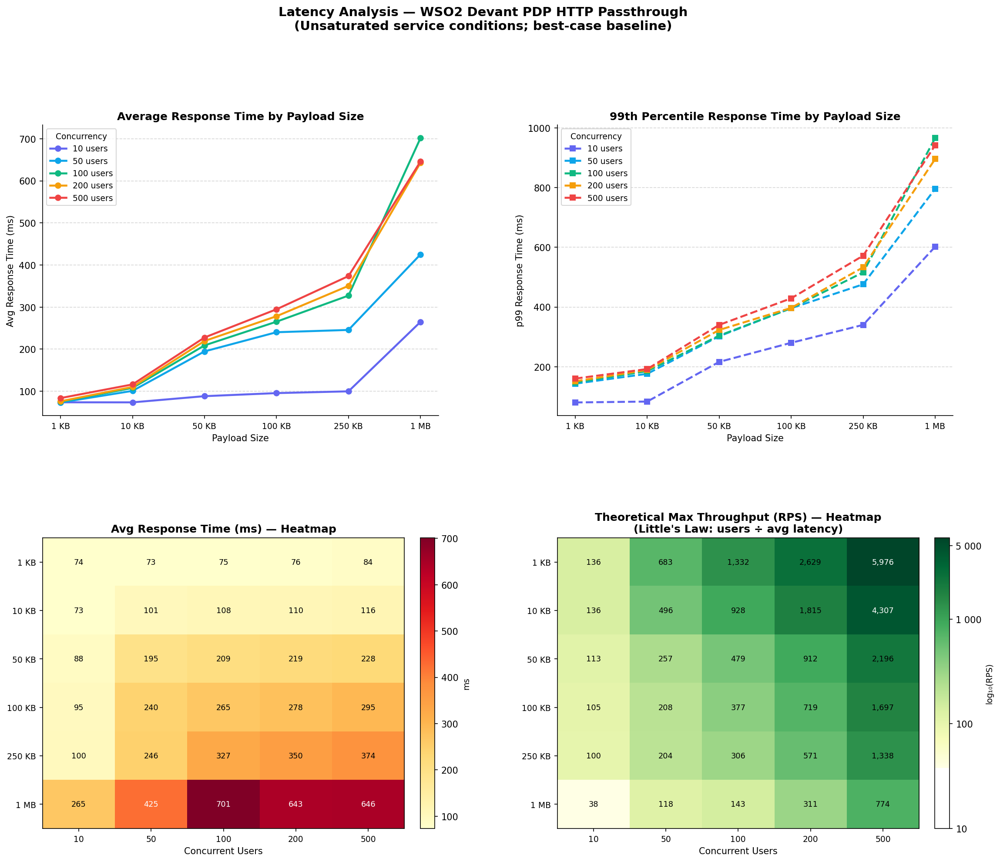
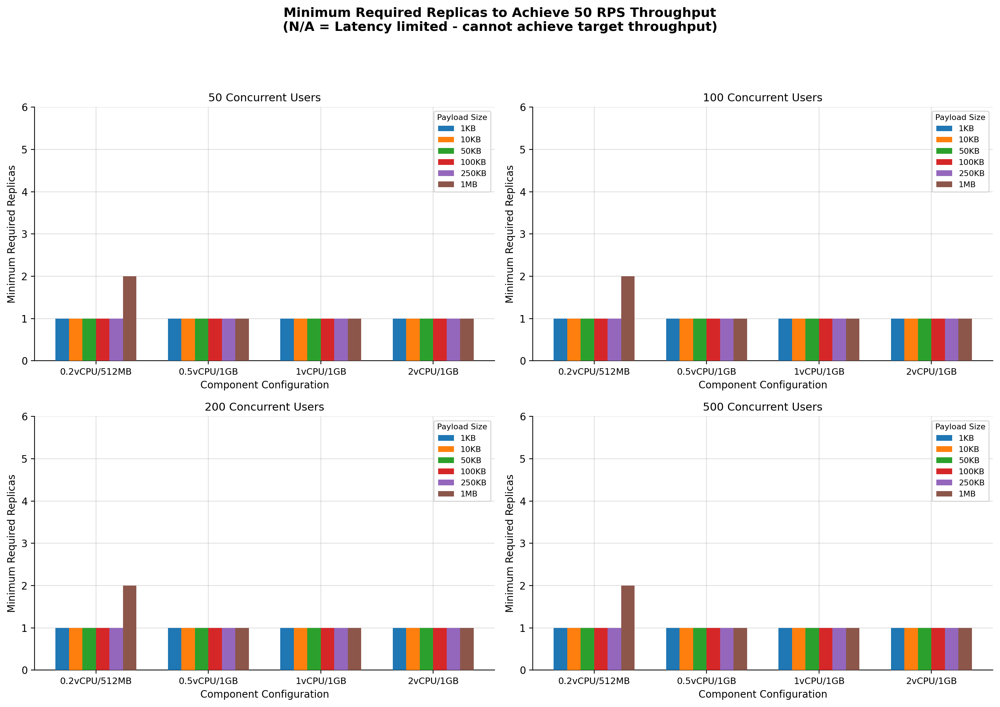
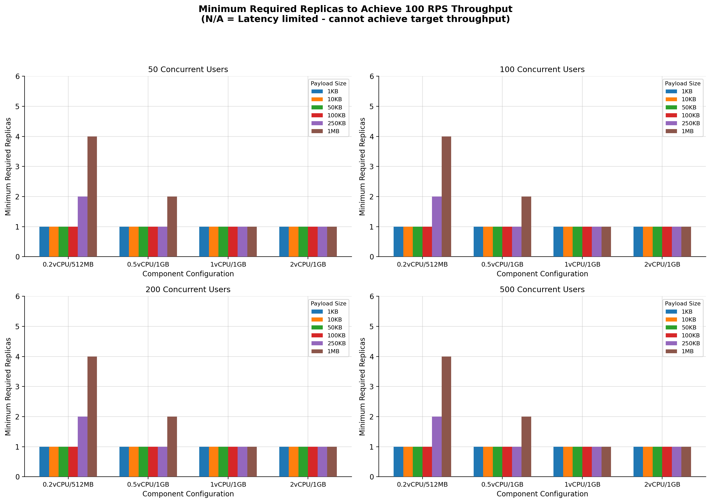
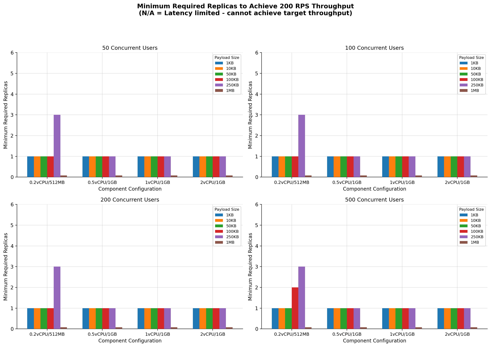
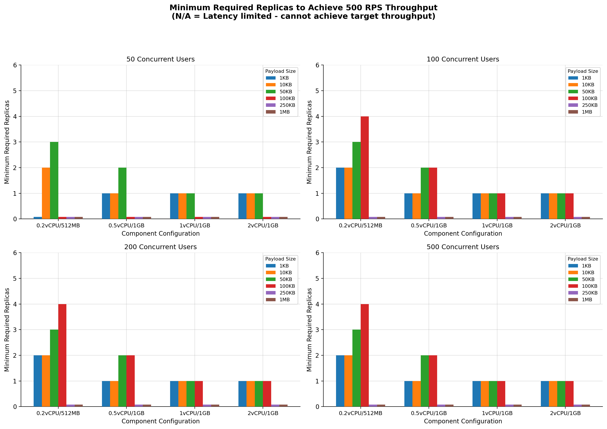
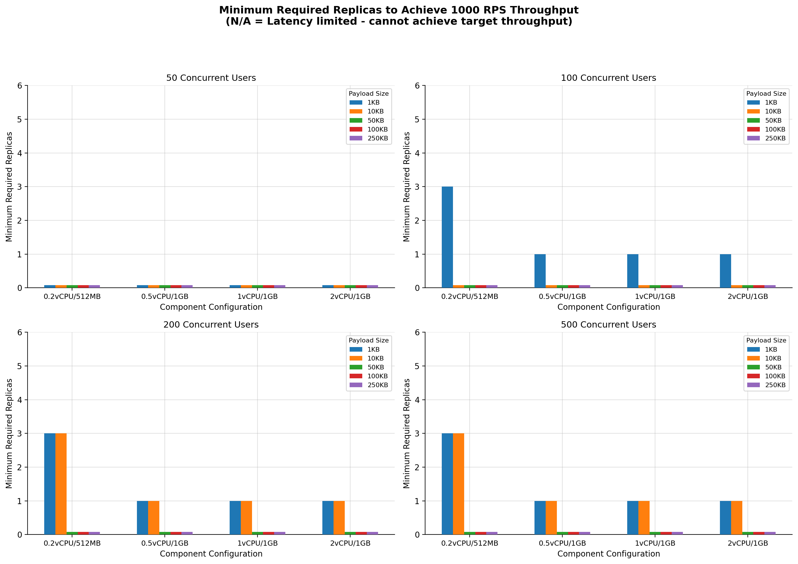
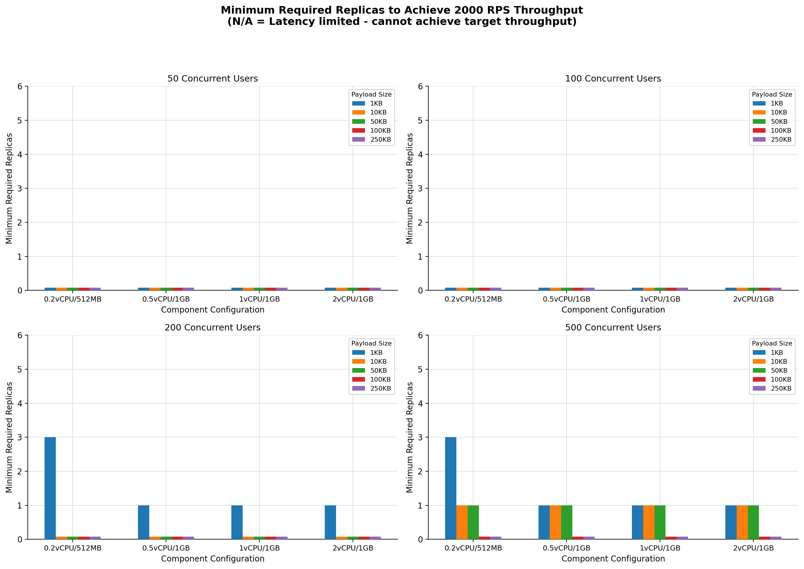
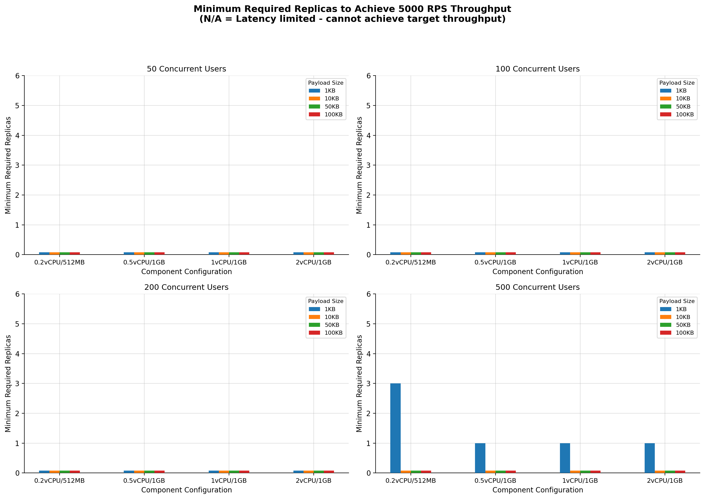

# Capacity Planning Report - WSO2 Cloud PDP

**Version:** v0.2.1-20260127 \
**Date:** 2026-01-27 \
**Scenario:** HTTP Passthrough \
**Product:** WSO2 Integrator: BI \
**Product Version:** Ballerina 2202.13.1 (Swan Lake Update 13) \
**Scale-to-Zero:** Disabled \
**Endpoint Authentication:** Enabled

---

## Table of Contents

- [Executive Summary](#executive-summary)
- [Test Methodology](#test-methodology)
- [Latency Analysis](#latency-analysis)
- [Performance Analysis Charts](#performance-analysis-charts)
- [Detailed Analysis](#detailed-analysis)
- [Resource Optimization Recommendations](#resource-optimization-recommendations)
- [Cost-Performance Analysis](#cost-performance-analysis)
- [Limitations and Constraints](#limitations-and-constraints)
- [Conclusions and Strategic Recommendations](#conclusions-and-strategic-recommendations)
- [Appendix 1: Test Data](#appendix-1-test-data)
- [Appendix 2: Latency Measurements](#appendix-2-latency-measurements)

---

## Executive Summary

This capacity planning report presents a comprehensive analysis of the WSO2 Cloud Private Data Plane (PDP) performance under various load conditions for an HTTP passthrough scenario. This version includes expanded testing with additional payload sizes (1KB, 10KB, 50KB, 100KB, 250KB, 1MB) and concurrent user counts (10, 50, 100, 200, 500), providing more granular insights into system behavior.

### Key Findings

1. **Optimal Performance Configuration**: The system achieves best performance with **1.0 CPU** and **1GB** memory allocation per replica for high-throughput scenarios (500+ RPS), while **0.5 CPU** and **1GB** memory works well for moderate loads (≤200 RPS)  

2. **Payload Size Impact**: Larger payloads significantly impact achievable throughput:  

   - **1KB-100KB payloads**: Achievable up to 500+ RPS with appropriate resource configurations  
   - **250KB payloads**: Achievable up to 200 RPS with ≥0.5 CPU; limited at higher throughput  
   - **1MB payloads**: Most constrained; achievable at ≤100 RPS with ≥0.5 CPU and ≥50 users; at 50 RPS, 0.2 CPU requires 2 replicas

3. **Concurrency Requirements by Little's Law**: Low concurrent user counts with high latency cannot achieve target throughput due to Little's Law constraint:  

   - **Average Effective Throughput \= Concurrent Users / Average Latency**  
   - N/A results indicate scenarios where latency is too high for the given user count to achieve target throughput  
   - 10 users consistently fails at ≥200 RPS and for 1MB payloads at any throughput

4. **High Throughput Limitations**: Throughput levels ≥1000 RPS show significant limitations:  

   - 1000 RPS: Only achievable with small payloads (≤10KB) and high concurrency (≥100-200 users)  
   - 2000 RPS: Achievable with 1KB (≥200 users) and 10KB-50KB (500 users only)  
   - 5000 RPS: Achievable only with 1KB payload and 500 concurrent users

5. **Memory Usage Observations**: Memory utilization was monitored across all configurations:  

   - When minimum replicas are found, there is no memory saturation observed  
   - **256MB was sufficient** for this passthrough service across all test scenarios  
   - Since this is a passthrough service, memory usage did not change significantly with different input metrics (payload size, throughput, concurrency)

6. **Latency as Primary Bottleneck**: When target throughput is not achievable (N/A results):  

   - CPU utilization is not saturated on the replicas  
   - Memory utilization is not saturated on the replicas  
   - This confirms that **network latency** (not compute resources) is the limiting factor  
   - The bottleneck lies in the round-trip time between client, WSO2 Cloud PDP, and backend

### Key Improvements from v0.1.0

1. **Testing Framework Upgrade**: Transitioned from load testing to stress testing methodology for more realistic production evaluation  
2. **Infrastructure Improvements**: Upgraded JMeter client to `m6a.xlarge` (4 vCPU, 16 GiB RAM, up to 12.5 Gbps) to eliminate client-side bottlenecks  
3. **Scale-to-Zero Disabled**: Removed cold start variability for consistent baseline measurements  
4. **Expanded Payload Testing**: Added 50KB, 100KB, 250KB, and 1MB payload sizes  
5. **Broader Concurrency Testing**: Added 10, 200, and 500 concurrent user levels  
6. **Simplified Resource Configurations**: Focused on 4 key configurations (0.2/512MB, 0.5/1GB, 1/1GB, 2/1GB)  
7. **Better Understanding of Latency Limitations**: Identified Little's Law as the primary constraint for N/A scenarios

### Next Steps

1. **Investigate Latency Bottlenecks**: Analyze latency patterns to understand why certain configurations fail  
2. **Network Optimization**: Evaluate network latency between client, WSO2 Cloud PDP, and backend  
3. **Extended Duration Tests**: Conduct long-running tests to identify performance degradation patterns  
4. **Scale-to-Zero Comparison**: Conduct parallel tests with scale-to-zero enabled to measure cold start impact

---

## Test Methodology

### Updated Testing Approach: Load Testing → Stress Testing

This version transitions from a **load testing** methodology to a **stress testing** framework that targets constant throughput levels to better evaluate system behavior under realistic conditions.

**Key Benefits of Stress Testing:**

- More accurate representation of production traffic patterns  
- Better identification of system breaking points  
- Consistent throughput targeting for reliable capacity planning

### Test Architecture

- **Client**: JMeter hosted on AWS `m6a.xlarge` (4 vCPU, 16 GiB RAM, up to 12.5 Gbps network bandwidth)  
- **Service**: WSO2 Integrator: BI passthrough service on WSO2 Cloud PDP  
- **Backend**: Netty backend hosted on AWS `c5.xlarge`  
- **Configuration**: Scale-to-zero disabled (for consistent baseline measurements)

**Infrastructure Upgrade Rationale:** The JMeter client upgrade to `m6a.xlarge` eliminates client-side bottlenecks in memory and network bandwidth, ensuring test results accurately reflect server-side capacity.

### Test Parameters Matrix

- **Throughput Targets**: 50, 100, 200, 500, 1000, 2000, 5000 RPS  
- **Concurrent Users**: 10, 50, 100, 200, 500 users  
- **Payload Sizes**: 1KB, 10KB, 50KB, 100KB, 250KB, 1MB  
- **Resource Configurations**: 4 different CPU/Memory combinations:  
  1. 0.2 vCPU / 512MB  
  2. 0.5 vCPU / 1GB  
  3. 1.0 vCPU / 1GB  
  4. 2.0 vCPU / 1GB

**Matrix Selection Criteria:** Test combinations are constrained by the AWS instance's maximum network bandwidth:

`throughput × concurrent_users × payload_size < 10 Gbps`

### N/A Results Explanation

**N/A (Not Achievable)** in results indicates that the target throughput cannot be achieved due to latency constraints, governed by Little's Law:

**Average Effective Throughput \= Concurrent Users / Average Latency**

When latency is high enough, the maximum achievable throughput is limited by the number of concurrent users, regardless of backend capacity. This is a client-side constraint, not a server-side limitation. See [Latency Analysis](#latency-analysis) for measured values and theoretical throughput calculations per configuration.

---

## Latency Analysis

### Response Time Measurements

The following charts visualise latency measurements recorded under conditions with no CPU or memory saturation on the passthrough service. These represent best-case (baseline) latency for each payload size and concurrency level, and are used to explain the N/A results observed in the test data. See [Appendix 2: Latency Measurements](#appendix-2-latency-measurements) for the full raw data table.

> **Little's Law**: Maximum Throughput (RPS) = Concurrent Users × 1000 / Average Response Time (ms)

*Figure: Top row — average and p99 response times by payload size, one line per concurrency level. Bottom row — heatmaps of average response time (ms) and theoretical max throughput (RPS) across the full payload × concurrency matrix.*

> **Note**: Latency measurements reflect unsaturated service conditions (best-case). Theoretical max throughput is an upper bound; actual achievable throughput may be lower due to network bandwidth constraints, particularly for larger payloads.

### Key Latency Observations

- **Small payloads (1KB–10KB)**: Response times remain consistently low (73–116 ms average) across all concurrency levels, enabling high throughput with minimal latency penalty
- **Medium payloads (50KB–100KB)**: Response time scales with payload size and concurrency; 50KB at 50 users (~195 ms) is roughly 2× higher than at 10 users (~88 ms), stabilizing at higher concurrency
- **Large payloads (250KB–1MB)**: Latency increases significantly with both payload size and concurrency. 1MB payloads range from ~265 ms at 10 users to ~701 ms at 100 users, severely constraining achievable throughput
- **Concurrency-latency trade-off**: Higher concurrent users slightly increases average latency due to queuing effects, but the net throughput gain outweighs this cost for small-to-medium payloads
- **N/A result validation**: The theoretical throughput values confirm the test observations — for example, with 10 users and 1MB payload, the theoretical maximum is only ~38 RPS, explaining why a 50 RPS target is N/A for that configuration

---

## Performance Analysis Charts

### Low Throughput Performance (50 RPS)

*Figure 1: Minimum required replicas to achieve 50 RPS throughput across different component configurations, shown for 50, 100, 200, and 500 concurrent users*

**Key Observations:**

- All configurations achieve 50 RPS with a single replica for payloads ≤250KB across all user counts  
- 1MB payloads with 10 users: N/A across all configurations (Little's Law constraint)  
- 1MB payloads with ≥50 users: 0.2 CPU requires 2 replicas; ≥0.5 CPU achieves single replica  
- No horizontal scaling required for payloads ≤250KB at this throughput level

---

### Medium-Low Throughput Performance (100 RPS)

*Figure 2: Minimum required replicas to achieve 100 RPS throughput across different component configurations, shown for 50, 100, 200, and 500 concurrent users*

**Key Observations:**

- Small payloads (1KB-100KB): Single replica sufficient for all configurations and user counts  
- 250KB payloads: Requires 2 replicas for 0.2 CPU configuration across all user counts  
- 1MB payloads: Requires 2-4 replicas for lower CPU configs; 1 CPU and 2 CPU achieve single replica  
- User count impact becomes visible with larger payloads

---

### Medium Throughput Performance (200 RPS)

*Figure 3: Minimum required replicas to achieve 200 RPS throughput across different component configurations, shown for 50, 100, 200, and 500 concurrent users*

**Key Observations:**

- Small payloads (1KB-50KB): Single replica sufficient with ≥50 users for most configurations  
- 100KB payloads: Single replica for most configs; 0.2 CPU with 500 users requires 2 replicas  
- 250KB payloads: Requires 3 replicas for 0.2 CPU configuration; ≥0.5 CPU achieves single replica  
- 1MB payloads: Not achievable at 200 RPS (all configurations show N/A)

---

### Medium-High Throughput Performance (500 RPS)

*Figure 4: Minimum required replicas to achieve 500 RPS throughput across different component configurations, shown for 50, 100, 200, and 500 concurrent users*

**Key Observations:**

- 50 users subplot shows N/A for 1KB with 0.2 CPU, but succeeds with ≥0.5 CPU  
- 1KB payloads: Requires 2 replicas for 0.2 CPU; ≥0.5 CPU achieves single replica  
- 10KB payloads: Requires 2 replicas for 0.2 CPU across all user counts shown  
- 50KB payloads: Requires 2-3 replicas; 0.5 CPU needs 2 replicas, ≥1 CPU achieves single replica  
- 100KB payloads: 50 users fails; 100+ users needs 2-4 replicas for lower configs  
- 250KB and 1MB payloads: Not achievable at 500 RPS (all show N/A)

---

### High Throughput Performance (1000 RPS)

*Figure 5: Minimum required replicas to achieve 1000 RPS throughput across different component configurations, shown for 50, 100, 200, and 500 concurrent users*

**Key Observations:**

- **50 users**: All payloads show N/A - insufficient concurrency to achieve 1000 RPS  
- **100 users**: Only 1KB payloads achievable; requires 3 replicas for 0.2 CPU, single replica for ≥0.5 CPU  
- **200+ users**: 1KB and 10KB payloads achievable; 0.2 CPU needs 3 replicas, ≥0.5 CPU achieves single replica  
- 50KB and larger payloads: Not achievable at 1000 RPS due to latency constraints

---

### Very High Throughput Performance (2000 RPS)

*Figure 6: Minimum required replicas to achieve 2000 RPS throughput across different component configurations, shown for 50, 100, 200, and 500 concurrent users*

**Key Observations:**

- **10-100 users**: All payloads show N/A - insufficient concurrency to achieve 2000 RPS  
- **200 users**: Only 1KB payloads achievable; requires 3 replicas for 0.2 CPU, single replica for ≥0.5 CPU  
- **500 users**: 1KB, 10KB, and 50KB payloads achievable; all configurations achieve single replica (except 0.2 CPU for 1KB needs 3 replicas)  
- 100KB and larger payloads: Not achievable at 2000 RPS due to latency constraints

---

### Extreme Throughput Performance (5000 RPS)

*Figure 7: Minimum required replicas to achieve 5000 RPS throughput across different component configurations, shown for 50, 100, 200, and 500 concurrent users*

**Key Observations:**

- **10-200 users**: All payloads show N/A - insufficient concurrency to achieve 5000 RPS  
- **500 users**: Only 1KB payload achievable; requires 3 replicas for 0.2 CPU, single replica for ≥0.5 CPU  
- 10KB and larger payloads: Not achievable at 5000 RPS due to latency constraints  
- This represents the practical upper limit for this test infrastructure

### Summary Heatmap

*Figure 8: Heatmap showing minimum replicas required across all configurations (100 users baseline)*

**Key Observations:**

- **White zones (1 replica)**: Dominate for lower throughput (50-200 RPS) across most payload sizes  
- **Blue zones (2-4 replicas)**: Appear primarily at higher throughput with larger payloads or low CPU configurations  
- **N/A zones**: Concentrate at 1000 RPS with payloads ≥50KB, indicating latency limitations  
- **Configuration efficiency**: 0.5 CPU / 1GB provides the best balance - achieving single replica for most scenarios where 0.2 CPU requires scaling  
- **Payload threshold at 1000 RPS**: Clear boundary where only 1KB and 10KB payloads remain achievable

---

### Payload Size Impact Analysis

*Figure 9: Impact of payload size on minimum replica requirements across different throughput levels*

**Key Observations:**

- **Linear scaling with payload**: Larger payloads consistently require more replicas at the same throughput  
- **1KB-10KB sweet spot**: These payload sizes show minimal scaling requirements up to 500 RPS  
- **100KB inflection point**: Beyond 100KB, replica requirements increase more steeply  
- **250KB-1MB cliff**: These payload sizes become unachievable at higher throughput levels (≥500 RPS for 250KB, ≥200 RPS for 1MB)  
- **0.2 CPU sensitivity**: Low CPU configurations show the steepest increase in replica requirements as payload size grows

---

### User Count Impact Analysis

*Figure 10: Impact of concurrent user count on achievability and replica requirements*

**Key Observations:**

- **10 users limitation**: Insufficient concurrency to achieve target throughput at ≥200 RPS due to Little's Law  
- **50-100 users threshold**: Most scenarios become achievable with 50+ users; 100 users provides comfortable margin  
- **Diminishing returns beyond 200 users**: Little additional benefit from 200 to 500 users for replica requirements  
- **User count independence for low throughput**: At ≤100 RPS, user count has minimal impact on replica requirements (except for 1MB payloads)  
- **Critical concurrency for high throughput**: 1000 RPS requires ≥100 users for 1KB and ≥200 users for 10KB

---

## Detailed Analysis

### 1. Very Low Throughput Scenarios (50 RPS)

**Performance Characteristics:**

- All resource configurations successfully handle 50 RPS with single replica for payloads ≤250KB  
- Payload size has minimal impact up to 250KB  
- 1MB payloads with 10 users fail due to Little's Law; ≥50 users succeed with appropriate resources

**Key Observations:**

- **Universal Success**: 1KB-250KB payloads work across all configurations and user counts  
- **1MB with 0.2 CPU**: Requires 2 replicas for ≥50 users; N/A for 10 users
- **1MB with ≥0.5 CPU**: Single replica sufficient for ≥50 users
- **Recommended Configuration**: 0.2 CPU / 512MB for payloads ≤250KB; 0.5 CPU / 1GB for 1MB

### 2. Low Throughput Scenarios (100 RPS)

**Performance Characteristics:**

- Small payloads remain easily achievable across all configurations  
- Medium payloads (250KB) show first signs of requiring scaling at low CPU  
- Large payloads (1MB) require significant resources or multiple replicas

**Key Observations:**

- **250KB Threshold**: First payload size requiring multiple replicas at 0.2 CPU; 10 users fails
- **1MB Challenge**: Requires 1-4 replicas depending on configuration; 10 users always fails
- **Recommended Configuration**: 0.5 CPU / 1GB for general use; 1 CPU / 1GB for large payloads

### 3. Medium Throughput Scenarios (200 RPS)

**Performance Characteristics:**

- Clear distinction between payload size capabilities emerges  
- 10 concurrent users cannot achieve target regardless of resources (Little's Law)  
- 1MB payloads become unachievable across all configurations

**Key Observations:**

- **Concurrency Requirement**: 10 users cannot achieve 200 RPS regardless of resources
- **Payload Ceiling**: 1MB payloads not achievable at this throughput level
- **Resource Efficiency**: Higher CPU configs (≥0.5 CPU) maintain single-replica performance for payloads ≤250KB

### 4. High Throughput Scenarios (500 RPS)

**Performance Characteristics:**

- Significant scaling requirements emerge for lower CPU configurations  
- Large payloads (100KB+) become increasingly constrained  
- 250KB and 1MB payloads not achievable at this throughput

**Key Observations:**

- **100KB Threshold**: Last payload size achievable; requires ≥100 users and appropriate scaling
- **Scaling Requirements**: 0.2 CPU requires 2-4 replicas; 0.5 CPU requires 1-2 replicas
- **Optimal Configuration**: 1.0 CPU / 1GB maintains single-replica for achievable scenarios (≤50KB)

### 5. Very High Throughput Scenarios (1000+ RPS)

**Performance Characteristics:**

- Severely constrained by concurrency and latency limitations
- Only small payloads (≤10KB) with high concurrency (≥100 users) succeed
- Most test scenarios show N/A results
- **Root Cause**: Combination of network latency and Little's Law constraints limits effective throughput

#### 5.1 — 1000 RPS Analysis

**Key Observations:**

- **1000 RPS**: Achievable for 1KB (≥100 users) and 10KB (≥200 users)
- Requires ≥0.5 CPU for single-replica operation
- Higher concurrency (200+ users) enables 10KB payload support

#### 5.2 — 2000 RPS Analysis

**Key Observations:**

- **2000 RPS**: Achievable for 1KB (≥200 users), 10KB and 50KB (500 users only)
- Requires 0.5+ CPU with 200+ concurrent users for 1KB payloads
- 10KB and 50KB payloads only achievable at 500 concurrent users

#### 5.3 — 5000 RPS Analysis

**Key Observations:**

- **5000 RPS**: Achievable only for 1KB with 500 concurrent users
- Requires 0.5+ CPU for single replica
- Highest concurrency and smallest payload required for any throughput target

---

## Resource Optimization Recommendations

### 1. Recommended Resource Configurations

| Throughput Target | Payload Size | Recommended CPU | Recommended Memory | Expected Replicas | Min Concurrent Users |
| ----: | ----: | ----: | ----: | ----: | ----: |
| ≤ 50 RPS | ≤1MB | 0.2 | 512MB | 1 | 50 |
| ≤ 100 RPS | ≤100KB | 0.2 | 512MB | 1 | 10 |
| ≤ 100 RPS | 250KB | 0.5 | 1GB | 1 | 50 |
| ≤ 100 RPS | 1MB | 1.0 | 1GB | 1 | 50 |
| 101-200 RPS | ≤100KB | 0.5 | 1GB | 1 | 50 |
| 101-200 RPS | 250KB | 0.5 | 1GB | 1 | 50 |
| 201-500 RPS | ≤10KB | 0.5 | 1GB | 1 | 50 |
| 201-500 RPS | 50KB | 1.0 | 1GB | 1 | 50 |
| 500-1000 RPS | ≤10KB | 1.0 | 1GB | 1 | 100-200 |
| 1000-2000 RPS | 1KB | 0.5 | 1GB | 1 | 200 |
| 1000-2000 RPS | 10KB-50KB | 0.5 | 1GB | 1 | 500 |
| 2000-5000 RPS | 1KB | 0.5 | 1GB | 1 | 500 |

### 2. Payload Size Guidelines

| Payload Size | Maximum Recommended Throughput | Notes |
| ----: | ----: | :---- |
| 1KB | 5000 RPS | Requires 500 concurrent users for 5000 RPS; single replica with ≥0.5 CPU |
| 10KB | 2000 RPS | Requires 500 concurrent users for 2000 RPS |
| 50KB | 2000 RPS | Requires 500 concurrent users for 2000 RPS |
| 100KB | 500 RPS | Requires ≥100 concurrent users; ≥1 CPU for single replica |
| 250KB | 200 RPS | Limited by latency at higher throughput; ≥0.5 CPU recommended |
| 1MB | 100 RPS | Limited to ≤100 RPS; requires ≥0.5 CPU and ≥50 users |

### 3. Concurrency Requirements

Little's Law governs the minimum concurrent users needed:

**Required Concurrent Users \= Target Throughput × Expected Latency**

Based on test results:

- **50-100 RPS**: 10+ users sufficient for small payloads  
- **200 RPS**: 50+ users required  
- **500 RPS**: 50+ users for small payloads; 100+ for medium  
- **1000 RPS**: 100-200+ users required
- **2000 RPS**: 200+ users for 1KB; 500 users for 10KB-50KB
- **5000 RPS**: 500 users required (1KB only)

---

## Cost-Performance Analysis

### 1. Resource Efficiency Metrics

**Calculation Formula:**

- **RPS/CPU** \= Target Throughput / (CPU per replica × Minimum required replicas)  
- **RPS/GB Memory** \= Target Throughput / ((Memory per replica in GB) × Minimum required replicas)

**Based on 500 RPS throughput with 10KB payload (100 users):**

| Configuration | Min Replicas | RPS/CPU | RPS/GB Memory | Cost Efficiency Rating |
| ----: | ----: | ----: | ----: | :---: |
| 0.2 CPU / 512MB | 2 | 1250 | 500 | Medium |
| 0.5 CPU / 1GB | 1 | 1000 | 500 | High |
| 1.0 CPU / 1GB | 1 | 500 | 500 | Medium |
| 2.0 CPU / 1GB | 1 | 250 | 500 | Low |

### 2. Recommended Cost-Optimized Configurations

1. **Budget-Conscious (Low Throughput)**: 0.2 CPU / 512MB - optimal for ≤100 RPS with small payloads  
2. **Balanced (Medium Throughput)**: 0.5 CPU / 1GB - best cost-performance ratio for 100-500 RPS  
3. **Performance-Focused (High Throughput)**: 1.0 CPU / 1GB - optimal for 500+ RPS  
4. **High-Performance**: 2.0 CPU / 1GB - minimal additional benefit over 1.0 CPU

---

## Limitations and Constraints

### 1. Little's Law Constraints

**Issue**: Maximum achievable throughput is limited by concurrent users and latency

- **Impact**: Low concurrency scenarios (10 users) cannot achieve target throughput at higher RPS  
- **Mitigation**: Ensure sufficient concurrent users based on expected latency

### 2. Payload Size Limitations

**Issue**: Large payloads (250KB+) significantly increase latency

- **Impact**: 1MB payloads limited to ≤100 RPS; 250KB limited to ≤200 RPS  
- **Mitigation**: For large payloads, reduce throughput expectations or implement chunking

### 3. High Throughput Barriers

**Issue**: 2000+ RPS achievable only in limited scenarios with high concurrency

- **2000 RPS**: Requires ≥200 users for 1KB; 500 users for 10KB-50KB payloads  
- **5000 RPS**: Requires 500 users and limited to 1KB payload only  
- **Root Cause**: Network latency between client and WSO2 Cloud PDP  
- **Recommendation**: Ensure high concurrent connections; consider regional deployment for lower latency

---

## Conclusions and Strategic Recommendations

### 1. Immediate Actions

1. **Right-size Resources**: Use 0.5 CPU / 1GB as baseline for most workloads  
2. **Set Concurrency Expectations**: Ensure clients maintain sufficient concurrent connections  
3. **Payload Optimization**: Consider compressing large payloads when possible

### 2. Capacity Planning Guidelines

1. **Small Payloads (≤10KB)**: Use 0.5 CPU / 1GB for up to 500 RPS; scale to 1 CPU for higher  
2. **Medium Payloads (50-100KB)**: Use 1 CPU / 1GB; expect ≤500 RPS  
3. **Large Payloads (250KB-1MB)**: Use 1 CPU / 1GB; expect ≤100-200 RPS

### 3. Future Testing Recommendations

1. **Latency Profiling**: Detailed latency breakdown (network, processing, backend)  
2. **Scale-to-Zero Comparison**: Parallel tests with scale-to-zero enabled to measure cold start impact  
3. **Regional Testing**: Test from different AWS regions to understand network impact  
4. **Load Balancer Testing**: Multi-replica behavior under load

### 4. Production Deployment Strategy

1. **Conservative Start**: Begin with 0.5 CPU / 1GB and monitor  
2. **Gradual Scaling**: Increase resources based on observed latency and throughput  
3. **Concurrent Connection Management**: Ensure client connection pools are properly sized

---

## Appendix 1: Test Data

**Note**:

- *N/A* indicates that the target throughput cannot be achieved due to latency constraints (Little's Law). The latency is high enough that the specific concurrent users cannot achieve the target throughput.  
- **Little's Law Constraint**: Average Effective Throughput \= Concurrent Users / Average Latency

### 50 RPS Results

| Concurrent Users | Payload Size | CPU per Replica | Memory per Replica (MB) | Minimum Required Replicas |
| ----: | ----: | ----: | ----: | :---: |
| 10 | 1KB | 0.2 | 512 | 1 |
| 10 | 1KB | 0.5 | 1024 | 1 |
| 10 | 1KB | 1 | 1024 | 1 |
| 10 | 1KB | 2 | 1024 | 1 |
| 50 | 1KB | 0.2 | 512 | 1 |
| 50 | 1KB | 0.5 | 1024 | 1 |
| 50 | 1KB | 1 | 1024 | 1 |
| 50 | 1KB | 2 | 1024 | 1 |
| 100 | 1KB | 0.2 | 512 | 1 |
| 100 | 1KB | 0.5 | 1024 | 1 |
| 100 | 1KB | 1 | 1024 | 1 |
| 100 | 1KB | 2 | 1024 | 1 |
| 200 | 1KB | 0.2 | 512 | 1 |
| 200 | 1KB | 0.5 | 1024 | 1 |
| 200 | 1KB | 1 | 1024 | 1 |
| 200 | 1KB | 2 | 1024 | 1 |
| 500 | 1KB | 0.2 | 512 | 1 |
| 500 | 1KB | 0.5 | 1024 | 1 |
| 500 | 1KB | 1 | 1024 | 1 |
| 500 | 1KB | 2 | 1024 | 1 |
| 10 | 10KB | 0.2 | 512 | 1 |
| 10 | 10KB | 0.5 | 1024 | 1 |
| 10 | 10KB | 1 | 1024 | 1 |
| 10 | 10KB | 2 | 1024 | 1 |
| 50 | 10KB | 0.2 | 512 | 1 |
| 50 | 10KB | 0.5 | 1024 | 1 |
| 50 | 10KB | 1 | 1024 | 1 |
| 50 | 10KB | 2 | 1024 | 1 |
| 100 | 10KB | 0.2 | 512 | 1 |
| 100 | 10KB | 0.5 | 1024 | 1 |
| 100 | 10KB | 1 | 1024 | 1 |
| 100 | 10KB | 2 | 1024 | 1 |
| 200 | 10KB | 0.2 | 512 | 1 |
| 200 | 10KB | 0.5 | 1024 | 1 |
| 200 | 10KB | 1 | 1024 | 1 |
| 200 | 10KB | 2 | 1024 | 1 |
| 500 | 10KB | 0.2 | 512 | 1 |
| 500 | 10KB | 0.5 | 1024 | 1 |
| 500 | 10KB | 1 | 1024 | 1 |
| 500 | 10KB | 2 | 1024 | 1 |
| 10 | 50KB | 0.2 | 512 | 1 |
| 10 | 50KB | 0.5 | 1024 | 1 |
| 10 | 50KB | 1 | 1024 | 1 |
| 10 | 50KB | 2 | 1024 | 1 |
| 50 | 50KB | 0.2 | 512 | 1 |
| 50 | 50KB | 0.5 | 1024 | 1 |
| 50 | 50KB | 1 | 1024 | 1 |
| 50 | 50KB | 2 | 1024 | 1 |
| 100 | 50KB | 0.2 | 512 | 1 |
| 100 | 50KB | 0.5 | 1024 | 1 |
| 100 | 50KB | 1 | 1024 | 1 |
| 100 | 50KB | 2 | 1024 | 1 |
| 200 | 50KB | 0.2 | 512 | 1 |
| 200 | 50KB | 0.5 | 1024 | 1 |
| 200 | 50KB | 1 | 1024 | 1 |
| 200 | 50KB | 2 | 1024 | 1 |
| 500 | 50KB | 0.2 | 512 | 1 |
| 500 | 50KB | 0.5 | 1024 | 1 |
| 500 | 50KB | 1 | 1024 | 1 |
| 500 | 50KB | 2 | 1024 | 1 |
| 10 | 100KB | 0.2 | 512 | 1 |
| 10 | 100KB | 0.5 | 1024 | 1 |
| 10 | 100KB | 1 | 1024 | 1 |
| 10 | 100KB | 2 | 1024 | 1 |
| 50 | 100KB | 0.2 | 512 | 1 |
| 50 | 100KB | 0.5 | 1024 | 1 |
| 50 | 100KB | 1 | 1024 | 1 |
| 50 | 100KB | 2 | 1024 | 1 |
| 100 | 100KB | 0.2 | 512 | 1 |
| 100 | 100KB | 0.5 | 1024 | 1 |
| 100 | 100KB | 1 | 1024 | 1 |
| 100 | 100KB | 2 | 1024 | 1 |
| 200 | 100KB | 0.2 | 512 | 1 |
| 200 | 100KB | 0.5 | 1024 | 1 |
| 200 | 100KB | 1 | 1024 | 1 |
| 200 | 100KB | 2 | 1024 | 1 |
| 500 | 100KB | 0.2 | 512 | 1 |
| 500 | 100KB | 0.5 | 1024 | 1 |
| 500 | 100KB | 1 | 1024 | 1 |
| 500 | 100KB | 2 | 1024 | 1 |
| 10 | 250KB | 0.2 | 512 | 1 |
| 10 | 250KB | 0.5 | 1024 | 1 |
| 10 | 250KB | 1 | 1024 | 1 |
| 10 | 250KB | 2 | 1024 | 1 |
| 50 | 250KB | 0.2 | 512 | 1 |
| 50 | 250KB | 0.5 | 1024 | 1 |
| 50 | 250KB | 1 | 1024 | 1 |
| 50 | 250KB | 2 | 1024 | 1 |
| 100 | 250KB | 0.2 | 512 | 1 |
| 100 | 250KB | 0.5 | 1024 | 1 |
| 100 | 250KB | 1 | 1024 | 1 |
| 100 | 250KB | 2 | 1024 | 1 |
| 200 | 250KB | 0.2 | 512 | 1 |
| 200 | 250KB | 0.5 | 1024 | 1 |
| 200 | 250KB | 1 | 1024 | 1 |
| 200 | 250KB | 2 | 1024 | 1 |
| 500 | 250KB | 0.2 | 512 | 1 |
| 500 | 250KB | 0.5 | 1024 | 1 |
| 500 | 250KB | 1 | 1024 | 1 |
| 500 | 250KB | 2 | 1024 | 1 |
| 10 | 1MB | 0.2 | 512 | N/A |
| 10 | 1MB | 0.5 | 1024 | N/A |
| 10 | 1MB | 1 | 1024 | N/A |
| 10 | 1MB | 2 | 1024 | N/A |
| 50 | 1MB | 0.2 | 512 | 2 |
| 50 | 1MB | 0.5 | 1024 | 1 |
| 50 | 1MB | 1 | 1024 | 1 |
| 50 | 1MB | 2 | 1024 | 1 |
| 100 | 1MB | 0.2 | 512 | 2 |
| 100 | 1MB | 0.5 | 1024 | 1 |
| 100 | 1MB | 1 | 1024 | 1 |
| 100 | 1MB | 2 | 1024 | 1 |
| 200 | 1MB | 0.2 | 512 | 2 |
| 200 | 1MB | 0.5 | 1024 | 1 |
| 200 | 1MB | 1 | 1024 | 1 |
| 200 | 1MB | 2 | 1024 | 1 |
| 500 | 1MB | 0.2 | 512 | 2 |
| 500 | 1MB | 0.5 | 1024 | 1 |
| 500 | 1MB | 1 | 1024 | 1 |
| 500 | 1MB | 2 | 1024 | 1 |

### 100 RPS Results

| Concurrent Users | Payload Size | CPU per Replica | Memory per Replica (MB) | Minimum Required Replicas |
| ----: | ----: | ----: | ----: | :---: |
| 10 | 1KB | 0.2 | 512 | 1 |
| 10 | 1KB | 0.5 | 1024 | 1 |
| 10 | 1KB | 1 | 1024 | 1 |
| 10 | 1KB | 2 | 1024 | 1 |
| 50 | 1KB | 0.2 | 512 | 1 |
| 50 | 1KB | 0.5 | 1024 | 1 |
| 50 | 1KB | 1 | 1024 | 1 |
| 50 | 1KB | 2 | 1024 | 1 |
| 100 | 1KB | 0.2 | 512 | 1 |
| 100 | 1KB | 0.5 | 1024 | 1 |
| 100 | 1KB | 1 | 1024 | 1 |
| 100 | 1KB | 2 | 1024 | 1 |
| 200 | 1KB | 0.2 | 512 | 1 |
| 200 | 1KB | 0.5 | 1024 | 1 |
| 200 | 1KB | 1 | 1024 | 1 |
| 200 | 1KB | 2 | 1024 | 1 |
| 500 | 1KB | 0.2 | 512 | 1 |
| 500 | 1KB | 0.5 | 1024 | 1 |
| 500 | 1KB | 1 | 1024 | 1 |
| 500 | 1KB | 2 | 1024 | 1 |
| 10 | 10KB | 0.2 | 512 | 1 |
| 10 | 10KB | 0.5 | 1024 | 1 |
| 10 | 10KB | 1 | 1024 | 1 |
| 10 | 10KB | 2 | 1024 | 1 |
| 50 | 10KB | 0.2 | 512 | 1 |
| 50 | 10KB | 0.5 | 1024 | 1 |
| 50 | 10KB | 1 | 1024 | 1 |
| 50 | 10KB | 2 | 1024 | 1 |
| 100 | 10KB | 0.2 | 512 | 1 |
| 100 | 10KB | 0.5 | 1024 | 1 |
| 100 | 10KB | 1 | 1024 | 1 |
| 100 | 10KB | 2 | 1024 | 1 |
| 200 | 10KB | 0.2 | 512 | 1 |
| 200 | 10KB | 0.5 | 1024 | 1 |
| 200 | 10KB | 1 | 1024 | 1 |
| 200 | 10KB | 2 | 1024 | 1 |
| 500 | 10KB | 0.2 | 512 | 1 |
| 500 | 10KB | 0.5 | 1024 | 1 |
| 500 | 10KB | 1 | 1024 | 1 |
| 500 | 10KB | 2 | 1024 | 1 |
| 10 | 50KB | 0.2 | 512 | 1 |
| 10 | 50KB | 0.5 | 1024 | 1 |
| 10 | 50KB | 1 | 1024 | 1 |
| 10 | 50KB | 2 | 1024 | 1 |
| 50 | 50KB | 0.2 | 512 | 1 |
| 50 | 50KB | 0.5 | 1024 | 1 |
| 50 | 50KB | 1 | 1024 | 1 |
| 50 | 50KB | 2 | 1024 | 1 |
| 100 | 50KB | 0.2 | 512 | 1 |
| 100 | 50KB | 0.5 | 1024 | 1 |
| 100 | 50KB | 1 | 1024 | 1 |
| 100 | 50KB | 2 | 1024 | 1 |
| 200 | 50KB | 0.2 | 512 | 1 |
| 200 | 50KB | 0.5 | 1024 | 1 |
| 200 | 50KB | 1 | 1024 | 1 |
| 200 | 50KB | 2 | 1024 | 1 |
| 500 | 50KB | 0.2 | 512 | 1 |
| 500 | 50KB | 0.5 | 1024 | 1 |
| 500 | 50KB | 1 | 1024 | 1 |
| 500 | 50KB | 2 | 1024 | 1 |
| 10 | 100KB | 0.2 | 512 | 1 |
| 10 | 100KB | 0.5 | 1024 | 1 |
| 10 | 100KB | 1 | 1024 | 1 |
| 10 | 100KB | 2 | 1024 | 1 |
| 50 | 100KB | 0.2 | 512 | 1 |
| 50 | 100KB | 0.5 | 1024 | 1 |
| 50 | 100KB | 1 | 1024 | 1 |
| 50 | 100KB | 2 | 1024 | 1 |
| 100 | 100KB | 0.2 | 512 | 1 |
| 100 | 100KB | 0.5 | 1024 | 1 |
| 100 | 100KB | 1 | 1024 | 1 |
| 100 | 100KB | 2 | 1024 | 1 |
| 200 | 100KB | 0.2 | 512 | 1 |
| 200 | 100KB | 0.5 | 1024 | 1 |
| 200 | 100KB | 1 | 1024 | 1 |
| 200 | 100KB | 2 | 1024 | 1 |
| 500 | 100KB | 0.2 | 512 | 1 |
| 500 | 100KB | 0.5 | 1024 | 1 |
| 500 | 100KB | 1 | 1024 | 1 |
| 500 | 100KB | 2 | 1024 | 1 |
| 10 | 250KB | 0.2 | 512 | N/A |
| 10 | 250KB | 0.5 | 1024 | N/A |
| 10 | 250KB | 1 | 1024 | N/A |
| 10 | 250KB | 2 | 1024 | N/A |
| 50 | 250KB | 0.2 | 512 | 2 |
| 50 | 250KB | 0.5 | 1024 | 1 |
| 50 | 250KB | 1 | 1024 | 1 |
| 50 | 250KB | 2 | 1024 | 1 |
| 100 | 250KB | 0.2 | 512 | 2 |
| 100 | 250KB | 0.5 | 1024 | 1 |
| 100 | 250KB | 1 | 1024 | 1 |
| 100 | 250KB | 2 | 1024 | 1 |
| 200 | 250KB | 0.2 | 512 | 2 |
| 200 | 250KB | 0.5 | 1024 | 1 |
| 200 | 250KB | 1 | 1024 | 1 |
| 200 | 250KB | 2 | 1024 | 1 |
| 500 | 250KB | 0.2 | 512 | 2 |
| 500 | 250KB | 0.5 | 1024 | 1 |
| 500 | 250KB | 1 | 1024 | 1 |
| 500 | 250KB | 2 | 1024 | 1 |
| 10 | 1MB | 0.2 | 512 | N/A |
| 10 | 1MB | 0.5 | 1024 | N/A |
| 10 | 1MB | 1 | 1024 | N/A |
| 10 | 1MB | 2 | 1024 | N/A |
| 50 | 1MB | 0.2 | 512 | 4 |
| 50 | 1MB | 0.5 | 1024 | 2 |
| 50 | 1MB | 1 | 1024 | 1 |
| 50 | 1MB | 2 | 1024 | 1 |
| 100 | 1MB | 0.2 | 512 | 4 |
| 100 | 1MB | 0.5 | 1024 | 2 |
| 100 | 1MB | 1 | 1024 | 1 |
| 100 | 1MB | 2 | 1024 | 1 |
| 200 | 1MB | 0.2 | 512 | 4 |
| 200 | 1MB | 0.5 | 1024 | 2 |
| 200 | 1MB | 1 | 1024 | 1 |
| 200 | 1MB | 2 | 1024 | 1 |
| 500 | 1MB | 0.2 | 512 | 4 |
| 500 | 1MB | 0.5 | 1024 | 2 |
| 500 | 1MB | 1 | 1024 | 1 |
| 500 | 1MB | 2 | 1024 | 1 |

### 200 RPS Results

| Concurrent Users | Payload Size | CPU per Replica | Memory per Replica (MB) | Minimum Required Replicas |
| ----: | ----: | ----: | ----: | :---: |
| 10 | 1KB | 0.2 | 512 | N/A |
| 10 | 1KB | 0.5 | 1024 | N/A |
| 10 | 1KB | 1 | 1024 | N/A |
| 10 | 1KB | 2 | 1024 | N/A |
| 50 | 1KB | 0.2 | 512 | 1 |
| 50 | 1KB | 0.5 | 1024 | 1 |
| 50 | 1KB | 1 | 1024 | 1 |
| 50 | 1KB | 2 | 1024 | 1 |
| 100 | 1KB | 0.2 | 512 | 1 |
| 100 | 1KB | 0.5 | 1024 | 1 |
| 100 | 1KB | 1 | 1024 | 1 |
| 100 | 1KB | 2 | 1024 | 1 |
| 200 | 1KB | 0.2 | 512 | 1 |
| 200 | 1KB | 0.5 | 1024 | 1 |
| 200 | 1KB | 1 | 1024 | 1 |
| 200 | 1KB | 2 | 1024 | 1 |
| 500 | 1KB | 0.2 | 512 | 1 |
| 500 | 1KB | 0.5 | 1024 | 1 |
| 500 | 1KB | 1 | 1024 | 1 |
| 500 | 1KB | 2 | 1024 | 1 |
| 10 | 10KB | 0.2 | 512 | N/A |
| 10 | 10KB | 0.5 | 1024 | N/A |
| 10 | 10KB | 1 | 1024 | N/A |
| 10 | 10KB | 2 | 1024 | N/A |
| 50 | 10KB | 0.2 | 512 | 1 |
| 50 | 10KB | 0.5 | 1024 | 1 |
| 50 | 10KB | 1 | 1024 | 1 |
| 50 | 10KB | 2 | 1024 | 1 |
| 100 | 10KB | 0.2 | 512 | 1 |
| 100 | 10KB | 0.5 | 1024 | 1 |
| 100 | 10KB | 1 | 1024 | 1 |
| 100 | 10KB | 2 | 1024 | 1 |
| 200 | 10KB | 0.2 | 512 | 1 |
| 200 | 10KB | 0.5 | 1024 | 1 |
| 200 | 10KB | 1 | 1024 | 1 |
| 200 | 10KB | 2 | 1024 | 1 |
| 500 | 10KB | 0.2 | 512 | 1 |
| 500 | 10KB | 0.5 | 1024 | 1 |
| 500 | 10KB | 1 | 1024 | 1 |
| 500 | 10KB | 2 | 1024 | 1 |
| 10 | 50KB | 0.2 | 512 | N/A |
| 10 | 50KB | 0.5 | 1024 | N/A |
| 10 | 50KB | 1 | 1024 | N/A |
| 10 | 50KB | 2 | 1024 | N/A |
| 50 | 50KB | 0.2 | 512 | 1 |
| 50 | 50KB | 0.5 | 1024 | 1 |
| 50 | 50KB | 1 | 1024 | 1 |
| 50 | 50KB | 2 | 1024 | 1 |
| 100 | 50KB | 0.2 | 512 | 1 |
| 100 | 50KB | 0.5 | 1024 | 1 |
| 100 | 50KB | 1 | 1024 | 1 |
| 100 | 50KB | 2 | 1024 | 1 |
| 200 | 50KB | 0.2 | 512 | 1 |
| 200 | 50KB | 0.5 | 1024 | 1 |
| 200 | 50KB | 1 | 1024 | 1 |
| 200 | 50KB | 2 | 1024 | 1 |
| 500 | 50KB | 0.2 | 512 | 1 |
| 500 | 50KB | 0.5 | 1024 | 1 |
| 500 | 50KB | 1 | 1024 | 1 |
| 500 | 50KB | 2 | 1024 | 1 |
| 10 | 100KB | 0.2 | 512 | N/A |
| 10 | 100KB | 0.5 | 1024 | N/A |
| 10 | 100KB | 1 | 1024 | N/A |
| 10 | 100KB | 2 | 1024 | N/A |
| 50 | 100KB | 0.2 | 512 | 1 |
| 50 | 100KB | 0.5 | 1024 | 1 |
| 50 | 100KB | 1 | 1024 | 1 |
| 50 | 100KB | 2 | 1024 | 1 |
| 100 | 100KB | 0.2 | 512 | 1 |
| 100 | 100KB | 0.5 | 1024 | 1 |
| 100 | 100KB | 1 | 1024 | 1 |
| 100 | 100KB | 2 | 1024 | 1 |
| 200 | 100KB | 0.2 | 512 | 1 |
| 200 | 100KB | 0.5 | 1024 | 1 |
| 200 | 100KB | 1 | 1024 | 1 |
| 200 | 100KB | 2 | 1024 | 1 |
| 500 | 100KB | 0.2 | 512 | 2 |
| 500 | 100KB | 0.5 | 1024 | 1 |
| 500 | 100KB | 1 | 1024 | 1 |
| 500 | 100KB | 2 | 1024 | 1 |
| 10 | 250KB | 0.2 | 512 | N/A |
| 10 | 250KB | 0.5 | 1024 | N/A |
| 10 | 250KB | 1 | 1024 | N/A |
| 10 | 250KB | 2 | 1024 | N/A |
| 50 | 250KB | 0.2 | 512 | 3 |
| 50 | 250KB | 0.5 | 1024 | 1 |
| 50 | 250KB | 1 | 1024 | 1 |
| 50 | 250KB | 2 | 1024 | 1 |
| 100 | 250KB | 0.2 | 512 | 3 |
| 100 | 250KB | 0.5 | 1024 | 1 |
| 100 | 250KB | 1 | 1024 | 1 |
| 100 | 250KB | 2 | 1024 | 1 |
| 200 | 250KB | 0.2 | 512 | 3 |
| 200 | 250KB | 0.5 | 1024 | 1 |
| 200 | 250KB | 1 | 1024 | 1 |
| 200 | 250KB | 2 | 1024 | 1 |
| 500 | 250KB | 0.2 | 512 | 3 |
| 500 | 250KB | 0.5 | 1024 | 1 |
| 500 | 250KB | 1 | 1024 | 1 |
| 500 | 250KB | 2 | 1024 | 1 |
| 10 | 1MB | 0.2 | 512 | N/A |
| 10 | 1MB | 0.5 | 1024 | N/A |
| 10 | 1MB | 1 | 1024 | N/A |
| 10 | 1MB | 2 | 1024 | N/A |
| 50 | 1MB | 0.2 | 512 | N/A |
| 50 | 1MB | 0.5 | 1024 | N/A |
| 50 | 1MB | 1 | 1024 | N/A |
| 50 | 1MB | 2 | 1024 | N/A |
| 100 | 1MB | 0.2 | 512 | N/A |
| 100 | 1MB | 0.5 | 1024 | N/A |
| 100 | 1MB | 1 | 1024 | N/A |
| 100 | 1MB | 2 | 1024 | N/A |
| 200 | 1MB | 0.2 | 512 | N/A |
| 200 | 1MB | 0.5 | 1024 | N/A |
| 200 | 1MB | 1 | 1024 | N/A |
| 200 | 1MB | 2 | 1024 | N/A |
| 500 | 1MB | 0.2 | 512 | N/A |
| 500 | 1MB | 0.5 | 1024 | N/A |
| 500 | 1MB | 1 | 1024 | N/A |
| 500 | 1MB | 2 | 1024 | N/A |

### 500 RPS Results

| Concurrent Users | Payload Size | CPU per Replica | Memory per Replica (MB) | Minimum Required Replicas |
| ----: | ----: | ----: | ----: | :---: |
| 10 | 1KB | 0.2 | 512 | N/A |
| 10 | 1KB | 0.5 | 1024 | N/A |
| 10 | 1KB | 1 | 1024 | N/A |
| 10 | 1KB | 2 | 1024 | N/A |
| 50 | 1KB | 0.2 | 512 | N/A |
| 50 | 1KB | 0.5 | 1024 | 1 |
| 50 | 1KB | 1 | 1024 | 1 |
| 50 | 1KB | 2 | 1024 | 1 |
| 100 | 1KB | 0.2 | 512 | 2 |
| 100 | 1KB | 0.5 | 1024 | 1 |
| 100 | 1KB | 1 | 1024 | 1 |
| 100 | 1KB | 2 | 1024 | 1 |
| 200 | 1KB | 0.2 | 512 | 2 |
| 200 | 1KB | 0.5 | 1024 | 1 |
| 200 | 1KB | 1 | 1024 | 1 |
| 200 | 1KB | 2 | 1024 | 1 |
| 500 | 1KB | 0.2 | 512 | 2 |
| 500 | 1KB | 0.5 | 1024 | 1 |
| 500 | 1KB | 1 | 1024 | 1 |
| 500 | 1KB | 2 | 1024 | 1 |
| 10 | 10KB | 0.2 | 512 | N/A |
| 10 | 10KB | 0.5 | 1024 | N/A |
| 10 | 10KB | 1 | 1024 | N/A |
| 10 | 10KB | 2 | 1024 | N/A |
| 50 | 10KB | 0.2 | 512 | 2 |
| 50 | 10KB | 0.5 | 1024 | 1 |
| 50 | 10KB | 1 | 1024 | 1 |
| 50 | 10KB | 2 | 1024 | 1 |
| 100 | 10KB | 0.2 | 512 | 2 |
| 100 | 10KB | 0.5 | 1024 | 1 |
| 100 | 10KB | 1 | 1024 | 1 |
| 100 | 10KB | 2 | 1024 | 1 |
| 200 | 10KB | 0.2 | 512 | 2 |
| 200 | 10KB | 0.5 | 1024 | 1 |
| 200 | 10KB | 1 | 1024 | 1 |
| 200 | 10KB | 2 | 1024 | 1 |
| 500 | 10KB | 0.2 | 512 | 2 |
| 500 | 10KB | 0.5 | 1024 | 1 |
| 500 | 10KB | 1 | 1024 | 1 |
| 500 | 10KB | 2 | 1024 | 1 |
| 10 | 50KB | 0.2 | 512 | N/A |
| 10 | 50KB | 0.5 | 1024 | N/A |
| 10 | 50KB | 1 | 1024 | N/A |
| 10 | 50KB | 2 | 1024 | N/A |
| 50 | 50KB | 0.2 | 512 | 3 |
| 50 | 50KB | 0.5 | 1024 | 2 |
| 50 | 50KB | 1 | 1024 | 1 |
| 50 | 50KB | 2 | 1024 | 1 |
| 100 | 50KB | 0.2 | 512 | 3 |
| 100 | 50KB | 0.5 | 1024 | 2 |
| 100 | 50KB | 1 | 1024 | 1 |
| 100 | 50KB | 2 | 1024 | 1 |
| 200 | 50KB | 0.2 | 512 | 3 |
| 200 | 50KB | 0.5 | 1024 | 2 |
| 200 | 50KB | 1 | 1024 | 1 |
| 200 | 50KB | 2 | 1024 | 1 |
| 500 | 50KB | 0.2 | 512 | 3 |
| 500 | 50KB | 0.5 | 1024 | 2 |
| 500 | 50KB | 1 | 1024 | 1 |
| 500 | 50KB | 2 | 1024 | 1 |
| 10 | 100KB | 0.2 | 512 | N/A |
| 10 | 100KB | 0.5 | 1024 | N/A |
| 10 | 100KB | 1 | 1024 | N/A |
| 10 | 100KB | 2 | 1024 | N/A |
| 50 | 100KB | 0.2 | 512 | N/A |
| 50 | 100KB | 0.5 | 1024 | N/A |
| 50 | 100KB | 1 | 1024 | N/A |
| 50 | 100KB | 2 | 1024 | N/A |
| 100 | 100KB | 0.2 | 512 | 4 |
| 100 | 100KB | 0.5 | 1024 | 2 |
| 100 | 100KB | 1 | 1024 | 1 |
| 100 | 100KB | 2 | 1024 | 1 |
| 200 | 100KB | 0.2 | 512 | 4 |
| 200 | 100KB | 0.5 | 1024 | 2 |
| 200 | 100KB | 1 | 1024 | 1 |
| 200 | 100KB | 2 | 1024 | 1 |
| 500 | 100KB | 0.2 | 512 | 4 |
| 500 | 100KB | 0.5 | 1024 | 2 |
| 500 | 100KB | 1 | 1024 | 1 |
| 500 | 100KB | 2 | 1024 | 1 |
| 10 | 250KB | 0.2 | 512 | N/A |
| 10 | 250KB | 0.5 | 1024 | N/A |
| 10 | 250KB | 1 | 1024 | N/A |
| 10 | 250KB | 2 | 1024 | N/A |
| 50 | 250KB | 0.2 | 512 | N/A |
| 50 | 250KB | 0.5 | 1024 | N/A |
| 50 | 250KB | 1 | 1024 | N/A |
| 50 | 250KB | 2 | 1024 | N/A |
| 100 | 250KB | 0.2 | 512 | N/A |
| 100 | 250KB | 0.5 | 1024 | N/A |
| 100 | 250KB | 1 | 1024 | N/A |
| 100 | 250KB | 2 | 1024 | N/A |
| 200 | 250KB | 0.2 | 512 | N/A |
| 200 | 250KB | 0.5 | 1024 | N/A |
| 200 | 250KB | 1 | 1024 | N/A |
| 200 | 250KB | 2 | 1024 | N/A |
| 500 | 250KB | 0.2 | 512 | N/A |
| 500 | 250KB | 0.5 | 1024 | N/A |
| 500 | 250KB | 1 | 1024 | N/A |
| 500 | 250KB | 2 | 1024 | N/A |
| 10 | 1MB | 0.2 | 512 | N/A |
| 10 | 1MB | 0.5 | 1024 | N/A |
| 10 | 1MB | 1 | 1024 | N/A |
| 10 | 1MB | 2 | 1024 | N/A |
| 50 | 1MB | 0.2 | 512 | N/A |
| 50 | 1MB | 0.5 | 1024 | N/A |
| 50 | 1MB | 1 | 1024 | N/A |
| 50 | 1MB | 2 | 1024 | N/A |
| 100 | 1MB | 0.2 | 512 | N/A |
| 100 | 1MB | 0.5 | 1024 | N/A |
| 100 | 1MB | 1 | 1024 | N/A |
| 100 | 1MB | 2 | 1024 | N/A |
| 200 | 1MB | 0.2 | 512 | N/A |
| 200 | 1MB | 0.5 | 1024 | N/A |
| 200 | 1MB | 1 | 1024 | N/A |
| 200 | 1MB | 2 | 1024 | N/A |
| 500 | 1MB | 0.2 | 512 | N/A |
| 500 | 1MB | 0.5 | 1024 | N/A |
| 500 | 1MB | 1 | 1024 | N/A |
| 500 | 1MB | 2 | 1024 | N/A |

### 1000 RPS Results

| Concurrent Users | Payload Size | CPU per Replica | Memory per Replica (MB) | Minimum Required Replicas |
| ----: | ----: | ----: | ----: | :---: |
| 10 | 1KB | 0.2 | 512 | N/A |
| 10 | 1KB | 0.5 | 1024 | N/A |
| 10 | 1KB | 1 | 1024 | N/A |
| 10 | 1KB | 2 | 1024 | N/A |
| 50 | 1KB | 0.2 | 512 | N/A |
| 50 | 1KB | 0.5 | 1024 | N/A |
| 50 | 1KB | 1 | 1024 | N/A |
| 50 | 1KB | 2 | 1024 | N/A |
| 100 | 1KB | 0.2 | 512 | 3 |
| 100 | 1KB | 0.5 | 1024 | 1 |
| 100 | 1KB | 1 | 1024 | 1 |
| 100 | 1KB | 2 | 1024 | 1 |
| 200 | 1KB | 0.2 | 512 | 3 |
| 200 | 1KB | 0.5 | 1024 | 1 |
| 200 | 1KB | 1 | 1024 | 1 |
| 200 | 1KB | 2 | 1024 | 1 |
| 500 | 1KB | 0.2 | 512 | 3 |
| 500 | 1KB | 0.5 | 1024 | 1 |
| 500 | 1KB | 1 | 1024 | 1 |
| 500 | 1KB | 2 | 1024 | 1 |
| 10 | 10KB | 0.2 | 512 | N/A |
| 10 | 10KB | 0.5 | 1024 | N/A |
| 10 | 10KB | 1 | 1024 | N/A |
| 10 | 10KB | 2 | 1024 | N/A |
| 50 | 10KB | 0.2 | 512 | N/A |
| 50 | 10KB | 0.5 | 1024 | N/A |
| 50 | 10KB | 1 | 1024 | N/A |
| 50 | 10KB | 2 | 1024 | N/A |
| 100 | 10KB | 0.2 | 512 | N/A |
| 100 | 10KB | 0.5 | 1024 | N/A |
| 100 | 10KB | 1 | 1024 | N/A |
| 100 | 10KB | 2 | 1024 | N/A |
| 200 | 10KB | 0.2 | 512 | 3 |
| 200 | 10KB | 0.5 | 1024 | 1 |
| 200 | 10KB | 1 | 1024 | 1 |
| 200 | 10KB | 2 | 1024 | 1 |
| 500 | 10KB | 0.2 | 512 | 3 |
| 500 | 10KB | 0.5 | 1024 | 1 |
| 500 | 10KB | 1 | 1024 | 1 |
| 500 | 10KB | 2 | 1024 | 1 |
| All | 50KB+ | All | All | N/A |

### 2000 RPS Results

| Concurrent Users | Payload Size | CPU per Replica | Memory per Replica (MB) | Minimum Required Replicas |
| ----: | ----: | ----: | ----: | :---: |
| 10-100 | All | All | All | N/A |
| 200 | 1KB | 0.2 | 512 | 3 |
| 200 | 1KB | 0.5 | 1024 | 1 |
| 200 | 1KB | 1 | 1024 | 1 |
| 200 | 1KB | 2 | 1024 | 1 |
| 200 | 10KB+ | All | All | N/A |
| 500 | 1KB | 0.2 | 512 | 3 |
| 500 | 1KB | 0.5 | 1024 | 1 |
| 500 | 1KB | 1 | 1024 | 1 |
| 500 | 1KB | 2 | 1024 | 1 |
| 500 | 10KB | 0.2 | 512 | 1 |
| 500 | 10KB | 0.5 | 1024 | 1 |
| 500 | 10KB | 1 | 1024 | 1 |
| 500 | 10KB | 2 | 1024 | 1 |
| 500 | 50KB | 0.2 | 512 | 1 |
| 500 | 50KB | 0.5 | 1024 | 1 |
| 500 | 50KB | 1 | 1024 | 1 |
| 500 | 50KB | 2 | 1024 | 1 |
| 500 | 100KB+ | All | All | N/A |

### 5000 RPS Results

| Concurrent Users | Payload Size | CPU per Replica | Memory per Replica (MB) | Minimum Required Replicas |
| ----: | ----: | ----: | ----: | :---: |
| 10-200 | All | All | All | N/A |
| 500 | 1KB | 0.2 | 512 | 3 |
| 500 | 1KB | 0.5 | 1024 | 1 |
| 500 | 1KB | 1 | 1024 | 1 |
| 500 | 1KB | 2 | 1024 | 1 |
| 500 | 10KB+ | All | All | N/A |

---

## Appendix 2: Latency Measurements

Response time measurements recorded under unsaturated service conditions (no CPU or memory saturation). These represent best-case (baseline) latency and are the source data for the [Latency Analysis](#latency-analysis) charts.

> **Little's Law**: Maximum Throughput (RPS) = Concurrent Users × 1000 / Average Response Time (ms)

| Payload Size | Concurrent Users | Avg Response Time (ms) | 99th Percentile (ms) | Theoretical Max Throughput (RPS) |
| :----------- | ---------------: | ---------------------: | -------------------: | -------------------------------: |
| 1 KB         |               10 |                  73.61 |                   80 |                             ~136 |
| 1 KB         |               50 |                  73.26 |                  143 |                             ~682 |
| 1 KB         |              100 |                  75.05 |                  147 |                           ~1,332 |
| 1 KB         |              200 |                  76.07 |                  151 |                           ~2,630 |
| 1 KB         |              500 |                  83.67 |                  160 |                           ~5,978 |
| 10 KB        |               10 |                  73.49 |                   83 |                             ~136 |
| 10 KB        |               50 |                 100.78 |                  176 |                             ~496 |
| 10 KB        |              100 |                 107.80 |                  185 |                             ~928 |
| 10 KB        |              200 |                 110.17 |                  189 |                           ~1,814 |
| 10 KB        |              500 |                 116.10 |                  192 |                           ~4,306 |
| 50 KB        |               10 |                  88.20 |                  216 |                             ~113 |
| 50 KB        |               50 |                 194.57 |                  302 |                             ~257 |
| 50 KB        |              100 |                 208.88 |                  304 |                             ~479 |
| 50 KB        |              200 |                 219.34 |                  323 |                             ~912 |
| 50 KB        |              500 |                 227.64 |                  340 |                           ~2,195 |
| 100 KB       |               10 |                  95.48 |                  280 |                             ~105 |
| 100 KB       |               50 |                 240.16 |                  396 |                             ~208 |
| 100 KB       |              100 |                 265.20 |                  396 |                             ~377 |
| 100 KB       |              200 |                 278.17 |                  397 |                             ~719 |
| 100 KB       |              500 |                 294.65 |                  429 |                           ~1,697 |
| 250 KB       |               10 |                  99.68 |                  340 |                             ~100 |
| 250 KB       |               50 |                 245.58 |                  476 |                             ~204 |
| 250 KB       |              100 |                 327.21 |                  516 |                             ~305 |
| 250 KB       |              200 |                 350.29 |                  533 |                             ~571 |
| 250 KB       |              500 |                 373.58 |                  572 |                           ~1,338 |
| 1 MB         |               10 |                 264.65 |                  602 |                              ~38 |
| 1 MB         |               50 |                 425.05 |                  796 |                             ~118 |
| 1 MB         |              100 |                 701.40 |                  966 |                             ~143 |
| 1 MB         |              200 |                 642.80 |                  896 |                             ~311 |
| 1 MB         |              500 |                 645.70 |                  942 |                             ~774 |

> Theoretical max throughput is an upper bound; actual achievable throughput may be lower due to network bandwidth constraints, particularly for larger payloads.

---

*This report provides a foundation for capacity planning decisions and should be updated as platform capabilities evolve and additional testing scenarios are completed.*
