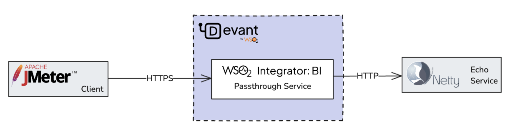
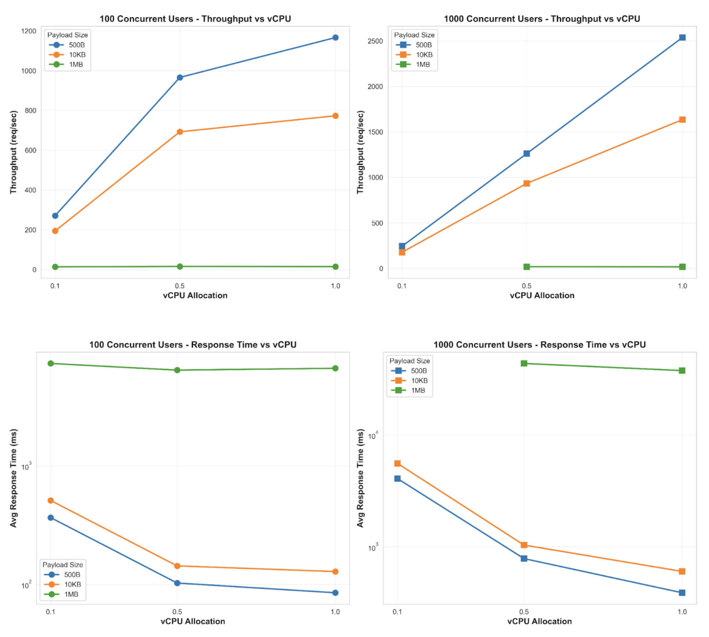
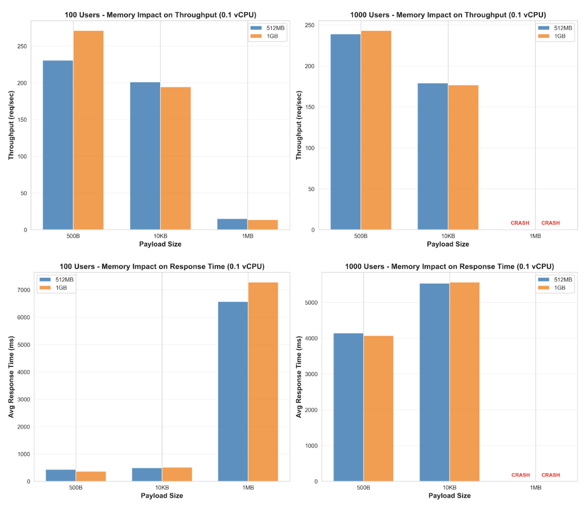
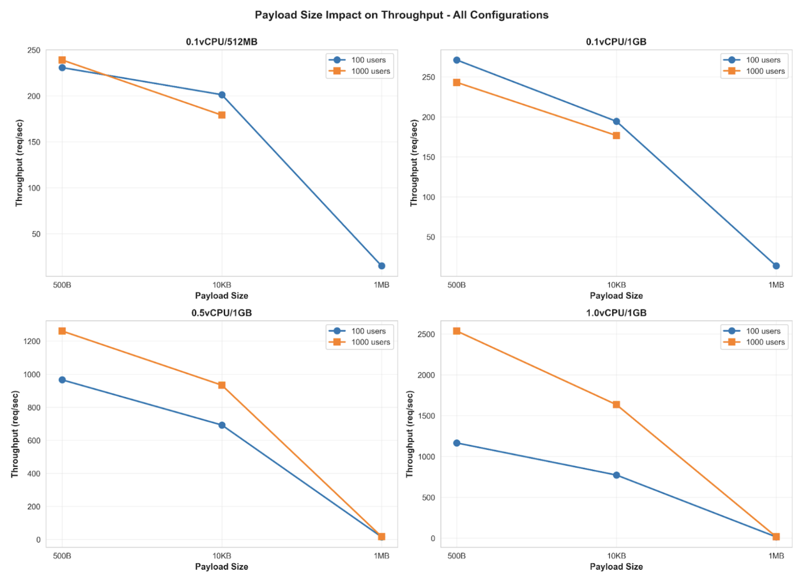
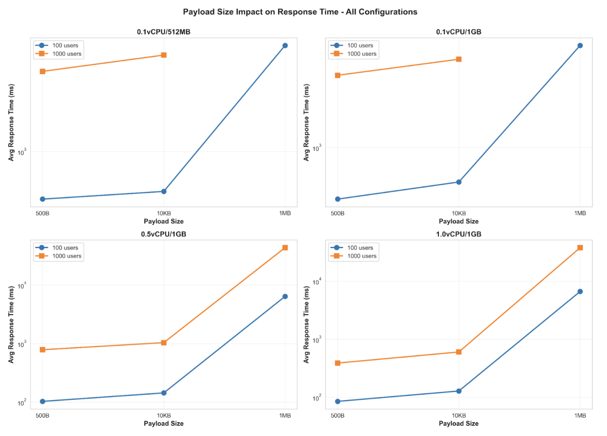
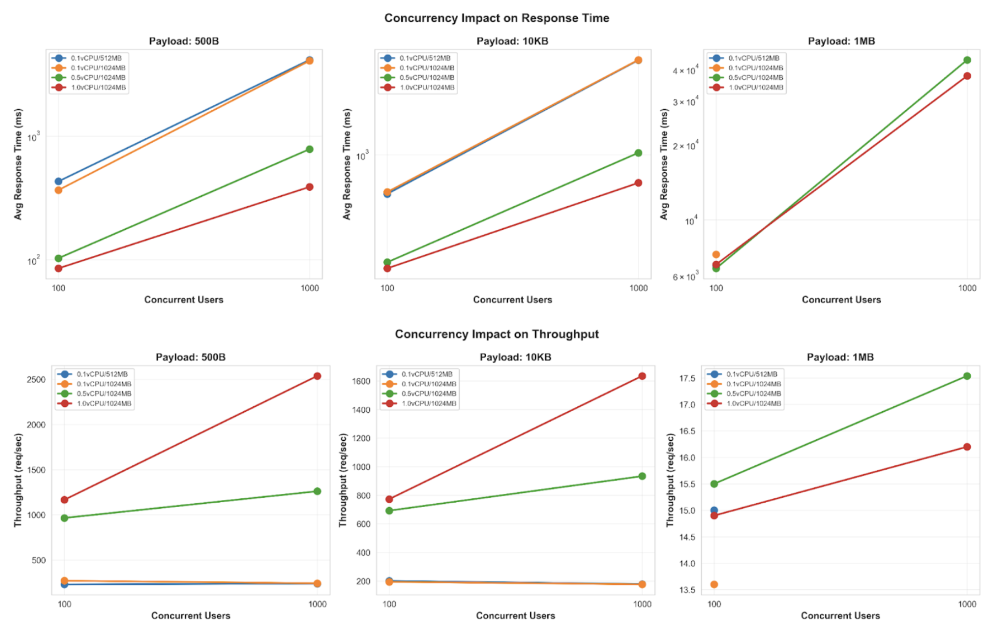

# Performance Testing - WSO2 Cloud PDP with WSO2 BI

## Table of Contents

- [Test Setup](#test-setup)
- [Deployment used for the test](#deployment-used-for-the-test)
- [Test Execution](#test-execution)
- [Test Flow](#test-flow)
- [Performance Analysis Results](#performance-analysis-results)
  - [1. Impact of vCPU Scaling on Performance](#1-impact-of-vcpu-scaling-on-performance)
  - [2. Memory Configuration Impact](#2-memory-configuration-impact-512mb-vs-1gb-at-01-vcpu)
  - [3. Payload Size Impact on Performance](#3-payload-size-impact-on-performance)
  - [4. Concurrency Impact](#4-concurrency-impact-100-vs-1000-users)
- [Summary and Key Findings](#summary-and-key-findings)
- [Recommendations and Next Steps](#recommendations-and-next-steps)
- [Appendix 1 - Test Results](#appendix-1---test-results-appendix-1---test-results)

---

This document presents a comprehensive performance analysis of WSO2 BI integration deployed in WSO2 Cloud. The performance testing was conducted using the following integration scenario:

- **Direct Proxy:** A PassThrough Proxy Service that directly invokes the back-end service without intermediate processing or transformation.

The following system configurations were evaluated for comparative performance analysis in WSO2 Cloud:

- **Configuration 1:** 0.1 vCPU, 512 MB Memory  
- **Configuration 2:** 0.1 vCPU, 1 GB Memory  
- **Configuration 3:** 0.5 vCPU, 1 GB Memory  
- **Configuration 4:** 1.0 vCPU, 1 GB Memory

**Note:** During all performance tests, `scale-to-zero` functionality is disabled in WSO2 Cloud, and both minimum and maximum replica counts are set to `1` to ensure consistent baseline measurements.

## Test Setup

The performance testing infrastructure consists of two distinct AWS EC2 instances to ensure accurate load generation and minimize interference:

- **Load Generator:** Apache JMeter 5.4.1 deployed on a dedicated EC2 instance  
- **Backend Service:** Netty HTTP echo server deployed on a separate EC2 instance

The test plan generates HTTP requests from JMeter to the WSO2 BI passthrough service in WSO2 Cloud. The service forwards these requests to the backend Netty echo server, which returns the same payload. The response is then relayed back to the JMeter client through the WSO2 BI service, creating a complete round-trip measurement.

**Test Parameters:**

- **Concurrent Users:** Tests were executed with 100 and 1,000 concurrent users to evaluate system behavior under different load conditions. Concurrent users represent simultaneous active sessions sending requests.  
- **Message Sizes (Payloads):** Three payload sizes were tested to assess performance across different data transfer scenarios: 500 bytes (small), 10 KB (medium), and 1 MB (large).

**Performance Metrics:**

Two primary performance indicators were measured for each test:

- **Throughput:** The number of requests successfully processed by the BI service in WSO2 Cloud per second, indicating system capacity  
- **Response Time:** The end-to-end latency from request initiation to response completion, including average, standard deviation, and 99th percentile measurements

**Resource Utilization Metrics:**

For each system configuration, the following resource metrics were captured from WSO2 Cloud runtime monitoring:

- **Maximum CPU Usage (%):** Peak CPU utilization during the test period  
- **Maximum Memory Usage (%):** Peak memory consumption during the test period

**Note:** CPU and Memory usage values are obtained from the WSO2 Cloud runtime monitoring section and provide approximate values suitable for comparative analysis. The pod-level monitoring should be consulted for precise resource consumption data.

## Deployment used for the test

| Name | EC2 Instance Type | vCPU | Memory (GiB) |
| :---- | :---- | :---- | :---- |
| Netty Echo Server | t2.large | 2 | 8 |
| JMeter Client | t2.xlarge | 4 | 16 |

- The operating system is Ubuntu 18.04.5 LTS  
- Java version is Java 8 for Netty backend and Java 21 for JMeter client

## Test Execution

A comprehensive performance testing script was developed to ensure consistent and reliable test execution. The testing execution includes the following phases:

1. **Warm-up Phase (5 minutes):** Initial test run with 10 users and 500B payload to stabilize the system, prime caches, and establish baseline conditions  
2. **Load Test Phase (10 minutes):** Full-scale performance tests executed with configured concurrent user counts and payload sizes  
3. **Cool-down Period (2 minutes):** Rest interval between consecutive tests to allow system stabilization and prevent carry-over effects  
4. **Resource Optimization:** JMeter runtime configured with optimized JVM parameters (8GB heap, G1 garbage collector) to handle high concurrency loads without client-side bottlenecks

## Test Flow

The test flow is as follows:

1. Start the Netty Echo server in the backend EC2 instance  
2. Configure the container-level settings in WSO2 Cloud for the required vCPU and Memory limits  
3. Configure the backend service URL and deploy the WSO2 BI passthrough service in WSO2 Cloud  
4. Set the passthrough service domain(DOMAIN) and the authorization header(AUTH\_HEADER) as environment variables in the JMeter client EC2 instance  
5. Run the performance test script  
6. Observe the memory and CPU usages from the WSO2 Cloud runtime metrics

## Performance Analysis Results

This section presents a comprehensive analysis of the performance test results, organized by different comparison dimensions. Each subsection examines a specific aspect of system performance with supporting visualizations and key insights.

The complete raw test data, including all measured metrics for every configuration, is available in [Appendix 1](#appendix-1---test-results-appendix-1---test-results).

### 1. Impact of vCPU Scaling on Performance

This analysis examines the relationship between CPU allocation and system performance by comparing throughput and response times across three vCPU configurations (0.1, 0.5, and 1.0 vCPU) while maintaining constant memory at 1GB. This isolates CPU as the variable to understand its impact on system capacity and responsiveness.  

**Key Observations:**

- Moving from 0.1 to 0.5 vCPU gives 256% throughput increase, but 1.0 vCPU only adds 21% more.  
- 500B and 10KB payloads benefit greatly from more CPU, but 1MB payloads stay around 15 req/sec regardless, likely due to network bandwidth limitations.  
- Average response time dropped from 365ms → 102ms → 85ms as CPU increased from 0.1 → 0.5 → 1.0 vCPU.  
- At 1000 users, 1.0 vCPU achieves 2537 req/sec vs 1261 req/sec at 0.5 vCPU.  
- 0.1 vCPU runs at 97-99% CPU usage, while 1.0 vCPU operates at 59-95%.

### 2. Memory Configuration Impact (512MB vs 1GB at 0.1 vCPU)

This analysis evaluates the impact of memory allocation on system performance and stability by comparing 512MB and 1GB memory configurations while maintaining minimal CPU allocation (0.1 vCPU). This helps identify whether memory constraints affect performance when CPU resources are limited.

**Key Observations:**

- Doubling memory from 512MB to 1GB improved throughput by 18% for small payloads (500B).  
- Response time improvement with 1GB is modest: 15% better for 100 users with 500B payload, but negligible for other payloads.  
- Both 512MB and 1GB configurations crashed at 1000 users with 1MB payload. This might be due to the low CPU  
- 1GB shows lower response time variability (lower standard deviation) indicating more stable performance.  
- At minimal CPU (0.1 vCPU), memory alone doesn't prevent crashes under extreme load (1000 users/1MB).

### 3. Payload Size Impact on Performance

This analysis demonstrates how system performance characteristics change with increasing message sizes (500B, 10KB, and 1MB) across all tested configurations. This reveals potential bottlenecks related to data transfer and processing rather than computational capacity.

**Key Observations:**

- At 0.5 vCPU, throughput drops from 965 req/sec (500B) to 692 req/sec (10KB) to only 15 req/sec (1MB).  
- Response times increase from 103ms (500B) to 143ms (10KB) to 6397ms (1MB).  
- All configurations maintain 13-17 req/sec for 1MB payloads, regardless of CPU allocation.  
- 1MB payloads show only 17-52% CPU usage vs 91-99% for small payloads, indicating the bottleneck is not compute resources.  
- The system is limited by network bandwidth, not CPU or memory, for large payloads - evidenced by high latency despite unsaturated CPU and memory in the WSO2 Cloud component.

### 4. Concurrency Impact (100 vs 1000 Users)

This analysis evaluates each system configuration's ability to scale under increased load by comparing performance metrics between 100 and 1,000 concurrent users—a 10x increase in concurrent sessions. This reveals which configurations can effectively handle production-scale concurrent workloads.

**Key Observations:**

- 0.1 vCPU shows only 4-13% throughput gain when going from 100 to 1000 users, but response times increase 8-12x.  
- 0.5 vCPU provides 31% throughput increase with acceptable response time growth.  
- 1.0 vCPU provides 118% throughput increase (1166 → 2537 req/sec) with only 4.6x response time increase.  
- Most tests show 0% errors, except with large payloads.  
- 0.1 vCPU/512MB configuration crashes at 1000 users with 1MB payload.

## Summary and Key Findings

The comprehensive performance testing of WSO2 BI integration in WSO2 Cloud reveals several critical insights:

**Optimal Configuration for Production Workloads:**

- The **0.5 vCPU / 1GB** configuration offers the best price-performance ratio for typical workloads, delivering 256% throughput improvement over 0.1 vCPU while maintaining cost efficiency  
- The **1.0 vCPU / 1GB** configuration is recommended for high-concurrency production environments (1,000+ users), providing 118% scalability improvement with only 4.6x response time increase

**Critical Performance Bottlenecks:**

- **Network bandwidth** is the primary bottleneck for large payloads (1MB), not CPU or memory—evidenced by consistently low throughput (\~15 req/sec) across all configurations despite unsaturated CPU  
- **Minimal CPU configurations (0.1 vCPU)** create a hard performance ceiling, showing poor scalability characteristics and system instability under high concurrency regardless of memory allocation

**Stability and Reliability:**

- Configurations with 512MB memory are prone to crashes under extreme load (1,000 users with 1MB payloads)  
- Both 512MB and 1GB memory configurations crash at 0.1 vCPU under maximum stress, confirming CPU as the critical resource for stability  
- Error rates remain exceptionally low (\<1%) for all configurations under typical load conditions, demonstrating system reliability

## Recommendations and Next Steps

Based on the performance testing results, the following recommendations are proposed for future investigation and optimization:

- **Network Bandwidth Enhancement:** The observed network bottleneck for large payloads (1MB) warrants investigation. The current EC2 test infrastructure uses general-purpose instances without AWS Enhanced Networking support. Consider upgrading to network-optimized instance types (e.g., c5n, m5n series) that provide up to 100 Gbps bandwidth to eliminate network as a bottleneck.  

- **Additional Resource Configurations:** Expand testing to include:  

  - 1.0 vCPU with 2GB memory (evaluate memory scaling impact at higher CPU)  
  - 2.0 vCPU with 2GB and 4GB memory (assess higher-tier performance)  
  - These configurations will provide comprehensive insights into vertical scaling characteristics

- **Horizontal Scaling Analysis:** Current tests use a single replica in WSO2 Cloud. Conduct multi-replica testing (2, 4, and 8 replicas) to evaluate horizontal scaling efficiency, and performance characteristics.  

- **Realistic Payload Distribution:** The 1MB payload size may not represent typical BI integration patterns. Consider a more realistic payload distribution:  

  - **Recommended sizes:** 500B, 1KB, 10KB, 100KB (aligned with typical API response sizes)  
  - **Concurrency levels:** 100, 200, 500, 1,000 users (graduated load testing)  
  - This will better reflect production usage patterns

- **Load Generation Enhancement:** Implement distributed JMeter configuration with multiple load generator instances to:  

  - Eliminate client-side bottlenecks at high concurrency  
  - Achieve more accurate representation of distributed user bases  
  - Support testing beyond 1,000 concurrent users if needed

## Appendix 1 - Test Results {#appendix-1---test-results}

**Note**: `N/A` indicates that the container crashed and restarted multiple times during the test and hence the results are not available.

| Concurrent Users | Payload Size | vCPU | Memory (MB) | Throughput (req/sec) | Error rate (%) | Avg Response Time (ms) | Standard Deviation of Response Time (ms) | 99th Percentile Response Time (ms) | Max CPU Usage (%) | Max Memory Usage (%) |
| :---- | :---- | :---- | :---- | :---- | :---- | :---- | :---- | :---- | :---- | :---- |
| 100 | 500B | 0.1 | 512 | 230.7 | 0.00 | 429.81 | 211.51 | 997.00 | 99 | 31 |
| 100 | 10KB | 0.1 | 512 | 201.2 | 0.00 | 492.69 | 229.62 | 1201.00 | 99 | 54 |
| 100 | 1MB | 0.1 | 512 | 15.0 | 0.12 | 6565.8 | 1867.52 | 10985.72 | 100 | 79 |
| 1000 | 500B | 0.1 | 512 | 239.0 | 0.00 | 4145.3 | 1260.63 | 8578.00 | 99 | 34 |
| 1000 | 10KB | 0.1 | 512 | 179.0 | 0.01 | 5531.7 | 1294.27 | 9104.00 | 99 | 56 |
| 1000 | 1MB | 0.1 | 512 | N/A | N/A | N/A | N/A | N/A | N/A | N/A |
| 100 | 500B | 0.1 | 1024 | 271.2 | 0.00 | 365.53 | 154.81 | 824.00 | 98 | 17 |
| 100 | 10KB | 0.1 | 1024 | 194.4 | 0.00 | 509.84 | 259.09 | 1305.00 | 97 | 26 |
| 100 | 1MB | 0.1 | 1024 | 13.6 | 1.05 | 7280.72 | 3427.75 | 31124.69 | 99 | 39 |
| 1000 | 500B | 0.1 | 1024 | 243.2 | 0.00 | 4070.88 | 1320.58 | 7289.00 | 99 | 25 |
| 1000 | 10KB | 0.1 | 1024 | 176.7 | 0.00 | 5564.44 | 1517.06 | 9975.64 | 99 | 29 |
| 1000 | 1MB | 0.1 | 1024 | N/A | N/A | N/A | N/A | N/A | N/A | N/A |
| 100 | 500B | 0.5 | 1024 | 965.8 | 0.00 | 102.61 | 32.47 | 196.00 | 91 | 16 |
| 100 | 10KB | 0.5 | 1024 | 692.4 | 0.00 | 143.14 | 36.96 | 248.00 | 90 | 25 |
| 100 | 1MB | 0.5 | 1024 | 15.5 | 0.00 | 6397.19 | 1535.63 | 10220.00 | 35 | 27 |
| 1000 | 500B | 0.5 | 1024 | 1261.1 | 0.00 | 784.15 | 288.19 | 1520.00 | 99 | 27 |
| 1000 | 10KB | 0.5 | 1024 | 933.5 | 0.00 | 1036.02 | 327.06 | 1852.00 | 99 | 28 |
| 1000 | 1MB | 0.5 | 1024 | 17.54 | 0.06 | 43585.41 | 18591.97 | 79078.49 | 52 | 37 |
| 100 | 500B | 1 | 1024 | 1166.3 | 0.00 | 84.96 | 38.00 | 121.00 | 59 | 15 |
| 100 | 10KB | 1 | 1024 | 773.1 | 0.00 | 128.20 | 215.11 | 209.00 | 56 | 23 |
| 100 | 1MB | 1 | 1024 | 14.9 | 0.00 | 6629.35 | 1644.95 | 10433.90 | 17 | 25 |
| 1000 | 500B | 1 | 1024 | 2537.3 | 0.00 | 388.02 | 147.06 | 828.26 | 95 | 24 |
| 1000 | 10KB | 1 | 1024 | 1634.7 | 0.00 | 601.83 | 314.87 | 1657.26 | 89 | 27 |
| 1000 | 1MB | 1 | 1024 | 16.2 | 0.22 | 37625.69 | 26444.26 | 91542.64 | 22 | 26 |
